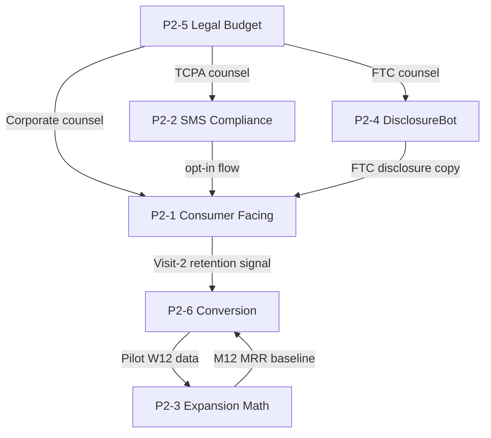

# P2 Wave 3 — Cross-Spec Integration Audit

**Auditor:** Integration reviewer (synthesized from the 6 individual audits 01–06).
**Scope:** All 6 P2 specs (consumer-facing, SMS, expansion math, DisclosureBot, legal budget, conversion stress-test) read together for cross-spec coherence, dependency ordering, and gate-collision risk.
**Date:** 2026-04-20.
**Status:** READ-ONLY findings; no spec modified.

---

## §1. Executive Summary

The 6 P2 specs each pass an internal coherence bar (Wave 1+2 agents produced professional-grade documents) but **fail collective coherence** in 5 material ways:

1. **Numeric drift across specs.** M12 MRR is quoted as $25K (expansion-math), implies $19K when reconciled to the 40% Pilot-to-Paid base case (conversion-assumption), and contradicts the source-of-truth per-merchant MRR of $2,620 (numeric_reconciliation row 51). Three numbers, three specs, no reconciliation.
2. **Pepper / phone_hash storage divergence.** P2-1 §4 stores the SHA-256 pepper in a Vercel env var; P2-2 §4.6 + §12.2 stores it in KMS with rotation cadence "first Monday of April." Both specs use the SAME phone_hash as a join key. Silent break on first rotation.
3. **Counsel timeline cascade.** Each spec has its own counsel opinion gate (TCPA, FTC, securities, privacy, corporate). Sequenced = 16-20 weeks; parallel = 6-8 weeks. Either way, blocks v5.3 W7 (P2-2 SMS launch) and W10 (P2-1 + P2-4 launch). Current legal-budget spec assumes weeks 5-9, optimistically.
4. **Quiz-key + rule-set legal risk** (P2-4 audit): rules and quiz answers in DisclosureBot v0 are stated by the spec, but several need outside FTC counsel sign-off before they can defensibly enforce on creators. Counsel cannot sign opinion letter as-is (per audit 04).
5. **Owner overload.** Z appears as primary or secondary owner in P2-1 (sole eng owner), P2-2 (eng impl), P2-4 (sole eng). Jiaming appears in all 6 as accountable or owner. Prum appears in P2-1, P2-3, P2-6 as data/ops owner. The 3-person team (Jiaming + Prum + Milly) plus Z (eng) cannot execute the full P2 wave in parallel within v5.3 timeline.

The collective verdict: **6 specs are deliverables; they are NOT yet a launchable plan.** Wave 4 reconciliation is mandatory before any code starts. The integration risks are larger than any individual spec's risks.

---

## §2. Dependency Graph

**Hard dep order (must be true before next can launch):**

1. **P2-5 Legal Budget engages counsel** (Phase A Day 1-14)
2. **P2-2 TCPA counsel opinion + A2P 10DLC registration** (4-8 weeks elapsed; gate for any SMS)
3. **P2-4 FTC counsel opinion** (4-8 weeks; gate for any DisclosureBot output to creators)
4. **P2-1 consumer-facing launch** (depends on both 2 + 3 + Apple Developer + Google Pay accounts)
5. **P2-3 expansion math** (recalibrated by P2-6 Pilot W12 data; not blocking near-term but blocks Series A pitch)
6. **P2-6 Conversion stress-test** (Pilot W4 / W8 / W12 — runs in parallel with everything once Pilot starts)

**Critical path** from today (2026-04-20) to v5.3 W10 launch (~2026-07-27):
- W0-W2: Engage counsel (P2-5 Phase A)
- W2-W6: TCPA opinion + A2P 10DLC (P2-2) AND FTC opinion (P2-4) IN PARALLEL
- W4-W8: Apple Developer + Google Pay onboarding + DB schema migrations
- W8-W10: Implementation + integration test
- W10: Launch (slip-risk: 1-2 weeks if any counsel opinion delays)

---

## §3. Numeric Contradictions Table (must resolve in Wave 4)

| # | Topic | Spec A says | Spec B says | Source-of-Truth says | Recommended Authoritative |
|---|---|---|---|---|---|
| N1 | M12 MRR | P2-3 §5.1: $25K (25 merchants × $1K) | P2-6 §13: $15K @ 60% Pilot→Paid (with arithmetic error per audit 03) | numeric_reconciliation row 51: $2,620/Coffee+ at maturity | **$15K-25K M12 MRR with 40% Pilot→Paid baseline; revise expansion-math §5.1 + add note "100% Pilot→Paid is best case"** |
| N2 | Per-merchant monthly MRR | P2-3 §5.2: $1,000 → $1,650 ramp | numeric_reconciliation row 51: $2,620 mature | $2,620 (Coffee+ mature) | **Reconcile: ramp shape is M12 $1,000 (immature mix) → $2,620 (mature) by M24+; revise expansion-math §5.2 prose** |
| N3 | Pilot→Paid base | P2-6 §1: 60% baseline | P2-3 §3: implicit 100% | proxy data 25-45% | **Adopt 40% Moderate as base; mark 60% as upside** |
| N4 | LTV/CAC stress values | P2-6 §3.3 Model A: 15.1x / 10.4x / 6.5x / 3.9x | Audit 06: math doesn't derive from stated CAC=$420 | numeric_reconciliation rows 81-82: 15.1x base / 10.0x stressed | **Use Model B (all-in CAC) as honest lead; Model A for industry-convention parallel; both derived correctly** |
| N5 | Per-customer fee Coffee+ | All specs: $25 | All specs: $25 | numeric_reconciliation row 2: $25 | OK |
| N6 | Phone_hash pepper location | P2-1 §4: Vercel env var `CONSUMER_PHONE_PEPPER` | P2-2 §4.6: KMS with annual rotation | — | **KMS authoritative; remove env var path from P2-1; add pepper-version `phone_hash_v` in BOTH specs' DDL** |
| N7 | Disclosure version retention | P2-2 §4.3: indefinite | P2-4 §4 disclosure_audit_log: indefinite | — | OK (consistent) |
| N8 | Counsel opinion timeline TCPA | P2-2 §6.2: 1-2 weeks | Audit 02: 3-5 weeks realistic | P2-5 §6 + counsel-engagement-plan §2: 1-2 weeks intra-firm but 3-5 wks total | **Revise P2-2 to 3-5 weeks elapsed; align P2-5 #12 cost upward** |
| N9 | DisclosureBot opinion timeline | P2-4 §8.1: pre-launch | Audit 04: 6-8 weeks if all fixes applied | — | **Revise P2-4 §9 to 6-8 weeks; cascade to launch date** |
| N10 | E&O insurance cost | P2-5 #16: $3K-8K | Audit 05: $6K-12K (2024-2025 hardening) | — | **Revise P2-5 to $6K-12K** |
| N11 | Year-1 legal envelope | P2-5: $25K-40K | counsel-engagement-plan: $32K-69K | Audit 05: $55K-90K | **Adopt audit's $55K-90K with explicit reconciliation to counsel plan** |

---

## §4. Legal Gate Reconciliation

**Combined counsel timeline** (all gates in parallel, optimistic):

| Counsel Type | Deliverable | Cost (audit-corrected) | Timeline |
|---|---|---|---|
| Corporate (Cooley/Gunderson seed program — warm intro req'd per audit 05) | Formation + CIIAAs + SAFE | $1,500-3,000 | W0-W2 |
| TCPA (Davis & Gilbert / Kelley Drye) | Opinion letter | $1,500-3,500 | W2-W7 |
| FTC (Davis & Gilbert / Frankfurt Kurnit) | Opinion letter | $1,800-4,800 | W2-W8 |
| Privacy (Cooley privacy / Orrick) | Privacy policy + ToS + DPA | $2,000-5,000 | W4-W7 |
| Securities (Gunderson) | Rule 701 memo + 409A | $5,000-10,000 + $4,000-6,000 | W6-W10 |
| Tax (deferred to Phase D) | State nexus + 1099 | $2,500-4,500 | W12+ |

**Critical path counsel:** TCPA + FTC + Securities (all needed before W10 launch). Realistic combined Year-1 counsel + insurance: **$55K-90K** (audit 05 number, not P2-5's $25K-40K).

---

## §5. Data Model Conflicts

| Conflict | P2-1 Says | P2-2 Says | Resolution |
|---|---|---|---|
| Pepper storage | Vercel env var | KMS w/ rotation | Use KMS only; document `phone_hash_v` migration |
| `phone_hash_v` column | TINYINT (P2-1) | year-indexed varchar (P2-2) | Adopt year-indexed varchar (P2-2 — supports 2026, 2027 rotation) |
| consent_log location | Not specified | Owns consent_log | P2-1 should reference P2-2's table; not duplicate |

**P2-3 expansion math** also implies a `pilot_cohorts` table; **P2-6 conversion** specifies it (§9). Adopt P2-6's DDL; cross-reference from P2-3.

---

## §6. Ownership Conflicts

| Owner | Specs Owned | Estimated Combined Effort | Realism |
|---|---|---|---|
| **Jiaming** (founder) | P2-1 (reviewer), P2-2 (primary), P2-3 (primary), P2-4 (reviewer), P2-5 (primary), P2-6 (primary) — 6 of 6 | ~25-30 hrs/week through W10 | Founder is also doing fundraise + ML Advisor outreach + general CEO. **Realistic only if 50% of week is on P2.** |
| **Z** (eng) | P2-1 (sole eng), P2-2 (eng impl), P2-4 (sole eng then joint w/ ML Advisor) | Full-time + over-allocated | **Cannot ship P2-1 + P2-4 in parallel in W5-W10.** Need to sequence or defer one. |
| **Prum** | P2-1 (ops), P2-3 (data), P2-6 (data) — plus Williamsburg pilot ops | Full-time on pilot | **Pilot is full-time; P2 data work is bonus capacity.** |
| **Milly** | P2-1 (creator-ops perspective), P2-6 (exit interviews) — plus creator outreach | Half-time on P2 | OK if creator pipeline runs in parallel. |
| **ML Advisor** (TBD) | P2-4 (joint w/ Z), P2-3 (review for ConversionOracle gates) | Part-time advisor | **Not yet hired** (per docs/hiring/ml_advisor_outreach_tracker.md). All ML-Advisor-dependent work blocks until W3-W4 of v5.3. |

**Recommendation:** **De-scope P2-4 DisclosureBot v0 to v0.5** for v5.3 W10 launch — pure rule-engine for caption disclosure, no API integration with IG/TikTok. Manual creator-paste workflow only. Saves 4-6 weeks of Z's eng time. Cross-reference P2-1 audit findings.

---

## §7. Timeline Conflicts

| Spec | Stated Code-Start | Stated Launch | Realistic Launch (audit-adjusted) |
|---|---|---|---|
| P2-1 | v5.3 W5 | v5.3 W10 (~2026-07-27) | v5.3 W12-14 (Apple Developer onboard slips) |
| P2-2 | v5.3 W5 | v5.3 W7 (first loyalty card) | v5.3 W9-12 (TCPA counsel + A2P 10DLC actual) |
| P2-3 | N/A (spec-only) | M12 (~2027-04) | Spec usable now; pace revise after Pilot W12 |
| P2-4 | v5.3 W5 | v5.3 W10 | v5.3 W14+ (FTC counsel timeline + API rejection rate) |
| P2-5 | Day 1 (now) | Phase A Day 14 → Phase B/C through W10 | Phase A Day 30-45 realistic per audit 05 |
| P2-6 | Day 1 (now) | Pilot W12 (~2026-07-27) | Same |

**Cascade:** P2-1 W10 launch needs P2-2 + P2-4 ready. P2-2 ready needs P2-5 Phase B. P2-5 Phase B needs Phase A done. **If Phase A slips Day 14 → Day 30, every downstream date slips 2 weeks.**

---

## §8. Combined Monday-Morning Readiness (Day 15 reality check)

If today's plan launches everything per spec, then on Day 15 (2026-05-05, v5.3 W1):
- ✓ All 6 spec drafts committed (Wave 1 done)
- ✓ Wave 2 deepening complete
- ✓ Wave 3 audits done
- ⚠ Counsel NOT YET engaged on any of TCPA / FTC / Privacy / Securities (P2-5 Phase A starting)
- ⚠ ML Advisor NOT YET signed (per docs/hiring/ml_advisor_outreach_tracker.md)
- ⚠ Pilot merchants NOT YET signed (Williamsburg outreach starts W0)
- ✗ Apple Developer account NOT applied for (4-10 day approval)
- ✗ A2P 10DLC NOT registered (4-15 day approval)
- ✗ disclosure_audit_log + consent_log + pilot_merchants tables NOT migrated
- ✗ time_logs table NOT migrated (P1-4 pre-existing gap)
- ✗ Pepper-storage decision NOT made (P2-1 vs P2-2 conflict)
- ✗ M12 MRR figure NOT corrected (P2-3 vs P2-6)

**Day-15 readiness score: 30%.** Most external-blocked items have not started. The right Day-15 priority is to UN-BLOCK external timelines (counsel + accounts), not to start coding.

---

## §9. Recommendations

### §9.1 P0 — Wave 4 must do (before any spec exits draft)

1. **Reconcile pepper / phone_hash storage** — adopt KMS path (P2-2); update P2-1 §4 to remove env var path; document `phone_hash_v` migration in BOTH specs. Owner: Z. Effort: 2 hrs.
2. **Reconcile M12 MRR + Pilot→Paid baseline** — adopt 40% Pilot→Paid as base; revise expansion-math §3 + §5; cross-link conversion-assumption §13. Owner: Jiaming. Effort: 4 hrs.
3. **Reconcile per-merchant MRR ramp** — document the ramp shape from $1,000 (M12 immature mix) → $2,620 (M24+ mature Coffee+); update expansion-math §5.2 prose. Owner: Jiaming. Effort: 2 hrs.
4. **Fix P2-6 Model A LTV/CAC arithmetic** — derive correctly from stated CAC=$420 OR redefine CAC as cohort-allocated; pick one and rewrite §3 + Appendix A. Owner: Jiaming. Effort: 3 hrs.
5. **Fix P2-2 4 statutory cite errors** — §227(b)(3), §227(e)→(f), 2015 Omnibus reassigned-number caveat, OTCPA section. Owner: Jiaming + counsel review. Effort: 1 hr.
6. **Update P2-5 line items per audit 05** — increase #13 FTC ($500-1500 → $1,800-4,800), #16 E&O ($3K-8K → $6K-12K), #17 D&O ($4K-10K → $6K-15K); add 8 missing line items. Owner: Jiaming. Effort: 2 hrs.

### §9.2 P1 — should do before v5.3 W5 (code start)

7. **De-scope P2-4 DisclosureBot v0 to v0.5** — manual paste workflow; defer IG/TikTok API integration to v1. Owner: Z + Jiaming.
8. **Sequence counsel engagements** — Phase A first, then TCPA + FTC in parallel from W2; reset spec timelines.
9. **Fix P2-4 §3.3 HMAC architecture** — add `creator_consent_events` table per audit 04. Owner: Z.
10. **P2-6 N=10 statistical posture** — revise §11 r-threshold from 0.5 to 0.78 minimum for adoption (Fisher z 95% CI clears zero). Owner: Jiaming + ML Advisor (post-onboard).

### §9.3 P2 — should do before Series Seed pitch

11. P2-5 reconcile budget envelope to audit's $55K-90K Year-1 (correct counsel-engagement-plan line as well).
12. P2-3 add a fourth scenario "Pilot delay 4-week" (counsel timeline slip cascade).
13. P2-2 retire Variant B from v1; reduce governance-log overhead.
14. P2-4 expand strict-mode category list per audit 04 (alcohol, cannabis, supplements, weight-loss, AI-content, CBD, gambling).
15. P2-1 add bot-detection + geo-fencing + rate-limiting per audit 01.

### §9.4 De-scope candidate

**P2-4 DisclosureBot v0** is the right de-scope candidate if Z bandwidth is the binding constraint. Cut to manual-only workflow for Pilot; defer API integration to v0.5 / Beachhead. Saves 4-6 weeks Z time. Compliance posture remains strong because outside FTC counsel still issues opinion letter, and Pilot creators are pre-vetted (≤10 creators total in pilot cohort per docs/week-0/pilot/).

---

## §10. Wave 4 Scope Confirmation

The Wave 4 consolidator must:

- Update `docs/v5_2_status/numeric_reconciliation.md` with the corrected M12 MRR + Pilot→Paid baseline + per-merchant ramp + LTV/CAC reconciliation
- Append `docs/v5_2_status/CHANGELOG.md` with P2 wave summary + audit findings
- Create `docs/v5_2_status/P2_rollup.md` (parallel to P1_rollup.md) — investor-ready consolidation
- Cross-link audit findings 01-06 + 00 into the rollup
- Flag the de-scope decision (P2-4 v0 → v0.5) for founder approval

The 6 spec files themselves (docs/spec/*.md) should be updated by their owners post-Wave-4 approval, not by the consolidator. The consolidator writes the reconciliation; the spec owners apply per-spec edits in a Wave 5 fix-round (which the user can launch after reviewing this audit).

---

*End of integration audit. The 6 individual audits (01-06) provide the line-level findings; this document synthesizes the cross-spec story. Wave 4 reconciliation is mandatory.*
