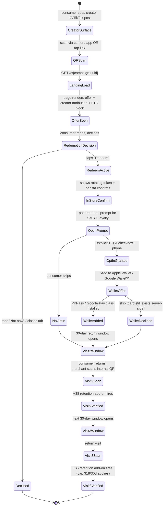

# Consumer-Facing QR Scan + Loyalty — Spec v1

> Canonical spec for the Push consumer surface: the landing page a consumer reaches after scanning a creator- or merchant-surfaced QR code, the redemption flow, the optional SMS opt-in, and the post-visit loyalty loop (visit-2 / visit-3 / Wallet card).
> This is a v1 spec, not an implementation plan. No code lands this sprint.

---

## Header

| Field | Value |
|---|---|
| Status | DRAFT v1 |
| Owner | Z (placeholder — confirm full name + Push email before review cycle) |
| Deliverable date | 2026-05-04 (Day 14 of current sprint) |
| Reviewers | Jiaming (founder, approval), outside privacy counsel (pending per `docs/legal/counsel-engagement-plan.md` §6), Z (primary author) |
| Pre-reads | [`Design.md`](../../Design.md), [`app/(marketing)/page.tsx`](../../app/(marketing)/page.tsx) (live FTC disclosure pattern L1640–L1666), [`.claude/skills/push-attribution/SKILL.md`](../../.claude/skills/push-attribution/SKILL.md), [`.claude/skills/push-pricing/SKILL.md`](../../.claude/skills/push-pricing/SKILL.md) §2.3, [`docs/spec/sms-compliance-v1.md`](./sms-compliance-v1.md) (P2-2 — SMS / TCPA, in drafting), [`docs/v5_2_status/audits/03-legal-compliance-register.md`](../v5_2_status/audits/03-legal-compliance-register.md) |
| Related numeric source of truth | [`docs/v5_2_status/numeric_reconciliation.md`](../v5_2_status/numeric_reconciliation.md) — any per-customer / retention figure quoted here is sourced from that file |
| Code-start trigger (hard gate) | Second paying Beachhead merchant has delivered **≥10 verified customers** (per numeric_reconciliation row 9, Beachhead window is merchants 11–50). Anticipated trigger: v5.3 Week 6 at earliest. See §9. |
| Target launch | v5.3 Week 9 (week of ~2026-07-27 if triggers fire on schedule) |
| Out-of-scope umbrella | See Appendix B. Notable: age-gated categories (alcohol/cannabis/tobacco), merchant-side Wallet pass management UI, multi-merchant universal loyalty card. |

---

## §1. User Journey

The consumer surface is a single-page, session-less experience keyed entirely by `campaign-uuid` in the URL. No consumer account exists. A loyalty card is an opt-in artifact created after redemption and keyed by `phone_hash` (SHA-256 of E.164 + server-side pepper, never the raw phone).

### 1.1 Happy-path state machine



Retention add-on values (visit-2 +$8, visit-3 +$6, loyalty onboarding +$4, cap $18/customer/30-day window) are sourced from `numeric_reconciliation.md` rows 10–13 and `.claude/skills/push-pricing/SKILL.md` §2.3.

### 1.2 Edge cases

| # | Scenario | Expected behavior | Failure mode if mishandled |
|---|---|---|---|
| E1 | Scan from desktop (not phone camera) | Landing renders; "Redeem" CTA shows a QR for the consumer's phone to continue on mobile | Desktop redemption creates orphan tokens |
| E2 | Campaign expired (end_at < now) | Render `/error?reason=expired` with campaign name + "This offer ended on {date}. Find current offers at push.nyc" | Consumer redeems stale offer, merchant declines, bad brand moment |
| E3 | Wrong-geo scan (consumer outside merchant radius) | Allow render, display offer, but gate activation on in-store token (rotating every 90s, validated server-side) | Fake redemption from couch |
| E4 | Offline merchant (no POS / lost internet) | Token remains valid for 10-min offline grace; barista writes last-4 of token on paper, reconciles later | False redemption rate spike |
| E5 | Network failure during opt-in POST | Client buffers opt-in payload; retries 3× with 250ms/1s/4s backoff; on final fail, shows "We couldn't save. Try SMS: text PUSH to 99999" | Silent data loss on the one moment we got explicit consent |
| E6 | Consumer already opted out (phone_hash in `consumer_sms_optout`) | Skip opt-in prompt entirely; still allow loyalty card creation without SMS | TCPA violation if we re-prompt |
| E7 | Pre-existing loyalty card for same merchant+phone_hash | Merge: bump `visit_count`, update `last_visit_at`, reuse `card_uuid`. Never duplicate | Double-counting visits inflates retention add-on |
| E8 | Repeat scan <30 min since last redemption | Idempotent — same `redemption_id` returned; no new visit counted | Per-customer fee double-charged |
| E9 | Creator deplatformed mid-campaign | Landing still renders but attribution byline becomes "Referred via a creator partner" (name redacted); creator payout handled separately per push-creator §5 | Consumer sees "referred by [banned creator]" post-deplatform |
| E10 | Merchant paused mid-campaign | Landing renders with status: "This merchant is not accepting referrals right now. Follow @{creator} for new offers." No token issued | Consumer walks to a closed store |
| E11 | Fraud flag on campaign (`campaign.fraud_flag = true`) | Freeze redemption, show `/error?reason=under_review`, notify ops channel | Fraudulent attribution ships |
| E12 | Consumer self-declares age <13 (COPPA) | Reject loyalty signup, redemption still allowed (anonymous), no SMS prompt | COPPA violation risk |
| E13 | Consumer blocks cookies / Safari ITP | Token is URL-based, not cookie-based. Works. Fallback: local-storage if available | Broken flow on privacy-forward browsers |

### 1.3 Abandonment flows

- **Declines redemption.** No data written beyond anonymous `page_view` event. No creator payout. Consumer can return later via same URL — state is stateless on the server until the consumer opts in to anything.
- **Redeems but skips SMS opt-in.** Visit-1 is still verified and counts toward the creator payout (primary revenue line). No SMS may ever be sent. Visit-2 / visit-3 retention add-ons depend on the merchant's internal QR scan at next visit — no SMS required. This is explicit: **under no circumstance does Push send marketing SMS to a consumer who has not completed the P2-2 TCPA double-opt-in flow**.
- **Redeems, opts in to SMS, declines Wallet.** Card exists server-side at `/loyalty/{card-uuid}`; consumer can access via SMS-delivered magic link on subsequent visits. Wallet can be added later.
- **Adds to Wallet, never returns.** After 24 months of `last_visit_at` inactivity, card auto-deletes per §6 CCPA retention schedule. Wallet pass revokes via push notification from the pass provider.

---

## §2. Pages & States

All routes served from Vercel Edge where SSR-feasible; tokens validated in a Node runtime route handler for KMS signing. Region affinity pinned to `iad1` (US-East) for Wallet signing key co-location.

### 2.1 Route table

| Route | Auth | Render | Cache | Rate-limit class | Region | Error state |
|---|---|---|---|---|---|---|
| `/c/[campaign-uuid]` | None (anonymous) | SSR (Edge) | `s-maxage=60, stale-while-revalidate=300` keyed by campaign_id | `consumer-view`: 60/min/IP | edge-global | Campaign not found → `/error?reason=not_found` |
| `/c/[campaign-uuid]/redeem` | None | CSR on top of SSR shell | `no-store` | `consumer-redeem`: 5/min/IP + 1/min/phone_hash | edge-global → route to `iad1` for token sign | Token sign failure → retry UI |
| `/c/[campaign-uuid]/visit-2` | Signed loyalty token | SSR | `no-store` | `consumer-return`: 10/min/IP | `iad1` | Invalid token → `/error?reason=token_invalid` |
| `/c/[campaign-uuid]/opt-out` | Signed token OR phone+code | CSR | `no-store` | `consumer-optout`: 5/min/IP | `iad1` | Any error → still honor opt-out, log separately |
| `/loyalty/[card-uuid]` | Signed card token | SSR | `no-store` | `loyalty-view`: 30/min/IP | `iad1` | Invalid / revoked → `/error?reason=card_revoked` |
| `/loyalty/[card-uuid]/revoke` | Signed card token | CSR | `no-store` | `loyalty-revoke`: 3/min/IP | `iad1` | Idempotent — second revoke is a no-op |
| `/loyalty/[card-uuid]/wallet.pkpass` | Signed card token | Binary response (Node runtime) | `private, max-age=3600` | `wallet-issue`: 10/day/card | `iad1` | Signing fail → 503 + retry-after |
| `/error` | None | SSR | `s-maxage=300` | `error-view`: 120/min/IP | edge-global | — |
| `/api/internal/verify-scan` | `INTERNAL_API_SECRET` header (per `middleware.ts`) | Node runtime | `no-store` | `internal-verify`: 300/min (shared) | `iad1` | Structured error envelope per `lib/api/responses.ts` |
| `/api/internal/loyalty-events` | `INTERNAL_API_SECRET` | Node runtime | `no-store` | `internal-loyalty`: 300/min | `iad1` | Same |

Rate-limit classes resolve to concrete numbers via `lib/rate-limit/*` (to be added); values above are targets.

### 2.2 Wireframes

All wireframes honor Design.md: Pearl Stone `#f5f2ec` background, Flag Red `#c1121f` primary CTA, Darky headline / CS Genio Mono body, `border-radius: 0` everywhere, 8px base grid.

**`/c/{campaign-uuid}` — Landing**
```
┌─────────────────────────────────────┐
│ [Push wordmark ──────── help link] │ <- 56px header, CS Genio Mono 14
├─────────────────────────────────────┤
│  {Merchant Name}                   │ <- Darky H1 48/56
│  {Offer headline, one line}        │ <- Darky H3 24
│                                    │
│  [Hero image / merchant photo]     │ <- 16:9, sharp corners
│                                    │
│  Referred by @{creator_handle}     │ <- CS Genio Mono 14, link to IG
│  [REDEEM NOW ─────────────]        │ <- Flag Red full-width CTA, 56px
│  Not now                           │ <- text link, graphite
│                                    │
│  FTC disclosure block               │ <- see §6
└─────────────────────────────────────┘
```

**`/c/{campaign-uuid}/redeem` — Active**
```
┌─────────────────────────────────────┐
│ [Push wordmark]                    │
├─────────────────────────────────────┤
│  Show this to the barista          │ <- Darky H2 36
│                                    │
│  ╔═══════════════════════════════╗ │
│  ║  ████████████████████████████ ║ │ <- rotating token, 90s refresh
│  ║  ████  ROTATING TOKEN  ██████ ║ │    sharp black square
│  ║  ████████████████████████████ ║ │    contains last-4 fallback
│  ╚═══════════════════════════════╝ │
│                                    │
│  Countdown: 01:27                  │ <- CS Genio Mono 14
│  Valid at {merchant address}       │
│                                    │
│  [I'M DONE — SHOW LOYALTY]         │ <- leads to opt-in
└─────────────────────────────────────┘
```

**`/c/{campaign-uuid}/visit-2` — Returning consumer**
```
┌─────────────────────────────────────┐
│ [Push wordmark]                    │
├─────────────────────────────────────┤
│  Welcome back.                     │ <- Darky H1
│  This is your 2nd visit to         │
│  {Merchant Name}.                  │
│                                    │
│  [Hero image]                      │
│                                    │
│  Visit 2/3 unlocks:                │ <- CS Genio Mono body
│  • {merchant-configured perk}      │
│                                    │
│  [SHOW BARISTA ────────────]       │ <- Flag Red CTA
│  [View my card]                    │ <- secondary link
└─────────────────────────────────────┘
```

**`/loyalty/{card-uuid}` — Wallet card management**
```
┌─────────────────────────────────────┐
│ [Push wordmark ──────── revoke]    │
├─────────────────────────────────────┤
│  {Merchant Name} card              │ <- Darky H2
│                                    │
│  Visits: ██ ██ ░░                  │ <- sharp squares, filled by count
│                                    │
│  Last visit: {ISO date}            │
│  Referred by @{creator_handle}     │
│                                    │
│  [ADD TO APPLE WALLET]             │ <- Flag Red CTA (sharp 0)
│  [Add to Google Wallet]            │ <- secondary
│                                    │
│  SMS: +1 *** *** 1234              │
│  [Manage SMS] [Delete my data]     │ <- graphite links, under CTA
└─────────────────────────────────────┘
```

**`/error` — Invalid / expired**
```
┌─────────────────────────────────────┐
│ [Push wordmark]                    │
├─────────────────────────────────────┤
│  {Contextual headline by reason}   │ <- Darky H1
│  {Plain-language explanation}      │ <- CS Genio Mono body
│                                    │
│  [FIND CURRENT OFFERS]             │ <- Flag Red CTA → push.nyc
│  support@push.nyc                  │ <- graphite mailto
└─────────────────────────────────────┘
```

---

## §3. Design Tokens

This spec does not redefine tokens. It points to `Design.md` and lists the specific tokens in scope.

### 3.1 Tokens in use

| Token | Value | Scope on consumer pages |
|---|---|---|
| `--surface` (Pearl Stone) | `#f5f2ec` | Page background, all five routes |
| `--primary` (Flag Red) | `#c1121f` | Primary CTA buttons, token border accent |
| `--dark` (Deep Space Blue) | `#003049` | Primary body copy, headline color |
| `--graphite` | `#4a5568` | Secondary / metadata text (timestamps, merchant address) |
| `--line` | `rgba(0, 48, 73, 0.12)` | Dividers, card borders |
| Typography: Darky | per Design.md Type Scale | H1 / H2 / H3 / H4 |
| Typography: CS Genio Mono | per Design.md Type Scale | Body, labels, buttons, captions |
| Border radius | `0` | All elements — CTAs, cards, images, tokens. No exceptions on the consumer surface (map pins 50% rule from Design.md does not apply — no map pins on consumer pages) |

### 3.2 Component reuse

- CTA button style should reuse the class used in `app/(marketing)/page.tsx` hero CTA (sharp corners, Flag Red fill, white text, CS Genio Mono 14px bold). No new CTA variant.
- FTC disclosure section should follow the same structural pattern as `app/(marketing)/page.tsx` L1640–L1666 (role="note", aria-labelledby, asterisk-prefixed body text), but with consumer-appropriate copy (see §6).
- Loyalty "visits" indicator uses sharp-square fill pattern — new component, to be spec'd by Z in v1.1.

### 3.3 Accessibility (WCAG 2.1 AA)

- **Contrast ratio — Flag Red `#c1121f` on Pearl Stone `#f5f2ec`:** approximately **5.3 : 1** (passes AA 4.5:1 for normal text and AA 3:1 for large text / CTA). White text on Flag Red fill: approximately **5.7 : 1** (passes AA). These computed ratios must be re-verified by the implementer using an automated tool (axe, WebAIM) before launch.
- All interactive elements must be keyboard-reachable and have a visible focus outline (2px `--primary` offset-2).
- Rotating redemption token must be announced to screen readers at every refresh (aria-live="polite") with token last-4 as text.
- Dynamic content (countdown timers) must not refresh more often than 5s at the screen-reader layer.

---

## §4. Data Model Additions

These tables are **spec only**. No migrations land this sprint. Field types target PostgreSQL via Supabase. All three tables contain PII or PII-derived fields and are subject to CCPA/GDPR deletion requests — retention schedule in §6.

```sql
-- ============================================================
-- consumer_visits
-- PII boundary: phone_hash (SHA-256 of E.164 + server pepper)
-- Retention: 24 months from last row per phone_hash × merchant_id,
--   then auto-delete via scheduled job.
-- ============================================================
CREATE TABLE consumer_visits (
  id                BIGSERIAL PRIMARY KEY,
  campaign_id       UUID        NOT NULL REFERENCES campaigns(id) ON DELETE RESTRICT,
  merchant_id       UUID        NOT NULL REFERENCES merchants(id) ON DELETE RESTRICT,
  creator_id        UUID        REFERENCES creators(id) ON DELETE SET NULL,
  consumer_phone_hash  BYTEA    NOT NULL,  -- 32 bytes, SHA-256(E.164 || pepper)
  visit_timestamp   TIMESTAMPTZ NOT NULL DEFAULT now(),
  visit_number      SMALLINT    NOT NULL CHECK (visit_number BETWEEN 1 AND 10),
  verified          BOOLEAN     NOT NULL DEFAULT false,
  verification_source TEXT      NOT NULL CHECK (
    verification_source IN ('qr_scan','merchant_manual','internal_override')
  ),
  token_last4       CHAR(4),    -- audit trail only
  created_at        TIMESTAMPTZ NOT NULL DEFAULT now()
);

CREATE INDEX idx_visits_phone_merchant ON consumer_visits (consumer_phone_hash, merchant_id, visit_timestamp DESC);
CREATE INDEX idx_visits_campaign ON consumer_visits (campaign_id, visit_timestamp DESC);
CREATE INDEX idx_visits_creator_verified ON consumer_visits (creator_id, verified, visit_timestamp DESC)
  WHERE verified = true;

-- ============================================================
-- loyalty_cards
-- PII boundary: phone_hash + card_uuid (treated as secret)
-- Retention: 24 months inactive (last_visit_at) → auto-delete
-- ============================================================
CREATE TABLE loyalty_cards (
  card_uuid         UUID        PRIMARY KEY DEFAULT gen_random_uuid(),
  consumer_phone_hash  BYTEA    NOT NULL,
  merchant_id       UUID        NOT NULL REFERENCES merchants(id) ON DELETE CASCADE,
  creator_id        UUID        REFERENCES creators(id) ON DELETE SET NULL,
  created_at        TIMESTAMPTZ NOT NULL DEFAULT now(),
  visit_count       SMALLINT    NOT NULL DEFAULT 1 CHECK (visit_count >= 1),
  last_visit_at     TIMESTAMPTZ NOT NULL DEFAULT now(),
  sms_opt_in        BOOLEAN     NOT NULL DEFAULT false,
  sms_opt_in_at     TIMESTAMPTZ,
  sms_opt_in_ip     INET,       -- TCPA audit trail
  sms_opt_in_ua     TEXT,
  revoked_at        TIMESTAMPTZ,
  CONSTRAINT uq_merchant_phone UNIQUE (merchant_id, consumer_phone_hash)
);

CREATE INDEX idx_cards_last_visit ON loyalty_cards (last_visit_at)
  WHERE revoked_at IS NULL;
CREATE INDEX idx_cards_phone ON loyalty_cards (consumer_phone_hash);

-- ============================================================
-- wallet_pass_meta
-- PII boundary: indirect (links to loyalty_cards).
-- Retention: cascades with loyalty_cards.
-- ============================================================
CREATE TABLE wallet_pass_meta (
  card_uuid            UUID PRIMARY KEY REFERENCES loyalty_cards(card_uuid) ON DELETE CASCADE,
  apple_pass_type_id   TEXT,                -- pass.nyc.push.loyalty.{merchant_slug}
  apple_serial_number  TEXT UNIQUE,         -- unique per pass
  apple_auth_token     TEXT,                -- used for web-service auth from device
  apple_issued_at      TIMESTAMPTZ,
  google_pass_class_id TEXT,                -- 3388000000022xxxx.{merchant_slug}
  google_object_id     TEXT UNIQUE,
  google_issued_at     TIMESTAMPTZ,
  last_update_at       TIMESTAMPTZ NOT NULL DEFAULT now()
);
```

**PII-hashing note (Wave 3 reconciliation 2026-04-20).** `phone_hash` = `SHA-256(E.164_phone || pepper_[year])`. **Authoritative pepper storage = KMS (per P2-2 sms-compliance-v1 §4.6 + §12.2).** The earlier draft's env-var path (`CONSUMER_PHONE_PEPPER`) is **deprecated** to avoid a silent join-key break with the SMS `consent_log`. Adopt P2-2's KMS-backed pepper with annual rotation on first Monday of April; store `pepper_version int` (year-indexed, e.g. 2026) per row in BOTH `consumer_visits` and `loyalty_cards`. Old peppers retained 4 years for hash regeneration during dual-read window. **Cross-spec invariant:** a single phone number must produce the SAME `phone_hash` in `consumer_visits`, `loyalty_cards`, AND `consent_log`. Raw phone is never persisted to the database; it lives only in transit (inbound from opt-in, outbound to Twilio). Twilio messaging logs are the system of record for raw phone.

**Hot-query access pattern.** The primary lookup is "does a loyalty card exist for this phone × this merchant?" — satisfied by `uq_merchant_phone` unique constraint. Secondary: "how many visits in the last 30 days for this phone × this merchant?" — `idx_visits_phone_merchant` covers this.

**RLS.** These tables live on the service-role schema per `lib/db/index.ts`; RLS is not the protection boundary. All reads/writes go through `lib/services/consumer/*.ts` which enforces phone-hash-only access. No anon client may touch these tables.

---

## §5. Integration Points

### 5.1 Apple Wallet (PKPass)

| Attribute | Value |
|---|---|
| Vendor account | Apple Developer Program — $99/yr |
| SDK / reference | [developer.apple.com/wallet](https://developer.apple.com/wallet/) + PKPass spec |
| Auth model | P.12 pass signing certificate + WWDR intermediate cert; per-merchant `passTypeIdentifier` (e.g., `pass.nyc.push.loyalty.merchant-slug`) |
| Rate limits / quota | Pass issuance: no hard Apple limit, but signing throughput is CPU-bound — budget 100 passes/sec per instance; Month-6 target ≤5k new passes/mo is well within capacity |
| Error handling | Signing failure → 503 with `retry-after`; device registration failure → log + best-effort retry on next update |
| Observability | Log every pass issue, update, register, unregister; alert if issue-success-rate <98% over 1-hour window |
| Security | P.12 private key in Vercel encrypted env var; rotation plan: annual or on compromise; pass web-service endpoint HTTPS-only, enforces `ApplePass` auth scheme |
| Hidden dependency | **Apple Developer account approval can take 2–10 business days** and requires DUNS number + legal-entity name verification. Start the application day 1 of v5.3 Week 1, not Week 5. Log in Appendix A. |

### 5.2 Google Wallet

| Attribute | Value |
|---|---|
| Vendor account | Google Pay & Wallet Console — free |
| SDK / reference | [developers.google.com/wallet](https://developers.google.com/wallet) — Generic / Loyalty pass class |
| Auth model | Service account JSON (Google Cloud IAM) with `wallet_object.issuer` role; signed JWT with `aud="google"`, `iss=service_account_email` |
| Rate limits / quota | Issuer API: 100 QPS default; request quota increase before Month-6 if projected issuance >20k/mo |
| Error handling | Signed JWT failure → log + show user "Try again"; class update conflict → exponential backoff, max 5 retries |
| Observability | Log class update, object create, device install callbacks |
| Security | Service account JSON in Vercel encrypted env var; `aud` claim pinned to `google`; restrict JWT signing to `/api/internal/*` routes |
| Hidden dependency | **Google Pay Issuer account approval typically 5–15 business days**; requires existing Apple Wallet pass as "parity reference" per Google reviewer guidance (anecdotal — confirm). |

### 5.3 SMS (Twilio)

| Attribute | Value |
|---|---|
| Vendor account | Twilio — ~$0.0075/SMS (US) + $1/mo Messaging Service + A2P 10DLC brand/campaign registration fee |
| SDK / reference | [twilio.com/docs/messaging](https://www.twilio.com/docs/messaging) |
| Auth model | Account SID + Auth Token; rotate Auth Token on any suspected leak |
| Rate limits / quota | A2P 10DLC tier-based; Month-6 estimated 5k SMS/mo (well within any tier) |
| Error handling | 4xx = drop + log; 5xx = retry with exponential backoff (max 3); delivery failure → do NOT auto-retry (carrier-blocked) |
| Observability | Log every send with `phone_hash` (not phone); alert on delivery-success-rate <95% over 1-hour window |
| Security | Webhook signature validation on inbound (STOP/HELP); TLS-only; no raw phone logged to our systems — delegated to Twilio console |
| Hidden dependency | **A2P 10DLC brand registration takes 3–10 business days**; campaign registration another 3–5. This is a long pole. Block on this by day 1 of v5.3 Week 1. |
| Compliance | Gated on P2-2 (docs/spec/sms-compliance-v1.md). **No SMS may be sent until P2-2 ships and the TCPA double-opt-in flow is live.** |

---

## §6. Compliance

### 6.1 TCPA (SMS)

Hard dependency on P2-2 `docs/spec/sms-compliance-v1.md`. This spec commits to: (a) explicit, unchecked opt-in checkbox in the opt-in UI; (b) immediate confirmation SMS with STOP/HELP language; (c) opt-in metadata stored in `loyalty_cards` (ip, UA, timestamp) as legal audit trail; (d) no marketing SMS ever sent pre-opt-in.

### 6.2 CCPA / CPRA

- **Right to delete:** `/loyalty/{card-uuid}/revoke` hard-deletes the `loyalty_cards` row and cascades `wallet_pass_meta`. `consumer_visits` rows are retained in anonymized form (phone_hash zeroed, `visit_number` preserved for creator payout audit trail) for 7 years per financial-record retention policy — to be confirmed with counsel.
- **Retention schedule:**
  - `loyalty_cards` with no activity for **24 months** (per `last_visit_at`) → auto-delete via nightly job, cascades wallet pass meta.
  - `consumer_visits` rows: kept 24 months live; after that, `consumer_phone_hash` zeroed but the aggregate row is preserved for campaign-level analytics and creator payout audit.
- **Do-not-sell:** Push does not sell consumer PII. "Do Not Sell My Personal Information" link in the footer is future-state (post-Series-A marketing growth).
- **Privacy policy:** must be updated before consumer page launches. Owner: founder + privacy counsel. Tracked in `docs/v5_2_status/audits/03-legal-compliance-register.md` row 20 (Supabase DPA) and must include consumer-specific retention language.

### 6.3 FTC 16 CFR § 255 (endorsement guide)

At every creator-attribution surface on the consumer pages, render the disclosure:

> **Consumer was referred by [Creator]. Creator may be compensated per verified visit.**

This is required on: `/c/{campaign-uuid}` (prominent, above the redeem CTA), `/c/{campaign-uuid}/redeem` (footer of the page, below the rotating token), `/loyalty/{card-uuid}` (in the "Referred by" metadata row), `/c/{campaign-uuid}/visit-2` (footer). The existing FTC block on `app/(marketing)/page.tsx` L1640 addresses illustrative marketing numbers — that is a different disclosure and does not replace this one. Cross-reference: `docs/v5_2_status/audits/03-legal-compliance-register.md` §Marketing/Advertising row 3 (landing FTC disclosure, shipped 2026-04-20).

### 6.4 NYC Local Law 144 (AEDT)

Consumer pages do not make employment or credit decisions → **out of scope.** If a future iteration adds "auto-VIP" tier decisions based on consumer behavior, LL-144 would re-attach and bias-audit requirements would apply. Flag logged in Appendix B.

### 6.5 PCI-DSS scope

The redemption flow does not handle card PAN at any point. Merchant accepts payment out-of-band via their existing POS. Push remains **out of PCI scope**. Enforcement: explicitly prohibit any "pay with card" feature in this product surface. If added later, scope impact must be re-assessed before shipping.

### 6.6 Accessibility (WCAG 2.1 AA)

Required: keyboard-only flow passes redemption and opt-in end-to-end; VoiceOver / TalkBack can read the rotating token and the FTC disclosure; contrast ratios verified per §3.3. Pre-launch: run `axe-core` on all five routes and fix any AA violations.

### 6.7 Age gating (COPPA)

Self-declaration checkbox at opt-in: "I am 13 or older." Users under 13 cannot create a loyalty card or opt in to SMS; redemption remains available anonymously. For merchants in age-restricted categories (alcohol, cannabis, tobacco), **v0 is not shipping any consumer flow** — see Appendix B item 7. Those categories require ID-scan verification and state-by-state legal review, deferred to v1.

---

## §7. Timeline

| Date / Window | Milestone | Gate |
|---|---|---|
| 2026-05-04 (Day 14) | Spec v1 finalized, reviewed by Z + Jiaming; privacy counsel pre-read scheduled | Spec approval |
| 2026-05-05 to ~2026-06-01 (v5.3 Weeks 1–4) | **No consumer code.** Focus: ML Advisor onboarding + pilot dependencies. In parallel: start Apple Developer account, Google Pay Issuer account, Twilio A2P 10DLC registration (long-pole approvals — see §5) | ML Advisor engaged |
| ~2026-06-02 (v5.3 Week 5) | Code work starts **only if** code-start trigger (§9) fires. Implementation kick-off by Z | Trigger met |
| v5.3 Weeks 5–8 | Implementation + internal testing + privacy counsel legal review of consumer pages + accessibility audit | Counsel sign-off, axe-core clean |
| ~2026-07-27 (v5.3 Week 9) | Launch with Apple Wallet integration active; Google Wallet in parallel track if Issuer-account approval landed | First live consumer redemption with Wallet card |
| v5.3 Week 10+ | Google Wallet GA, loyalty tier evolution, optional merchant-side loyalty dashboard | Product-led from Beachhead expansion learnings |

Dates are calendar targets; the Week-5 start is contingent on §9. Slippage beyond Week 11 launch requires founder escalation.

---

## §8. Owner & Working Group

| Role | Person | Responsibility |
|---|---|---|
| Primary owner | **Z** (placeholder — confirm name + Push email on Day 2 of sprint) | Spec drives, review, implementation lead |
| Founder review / approval | Jiaming | Final sign-off, product + legal escalation |
| Ops liaison | Prum | Merchant onboarding implications, pilot-merchant recruitment for Week 4 check-ins |
| Creator-ops liaison | Milly | Creator-attribution surface copy, creator deplatform edge case (E9) |
| ML Advisor (technical) | TBD via `docs/hiring/ml_advisor_outreach_tracker.md` | Verification pipeline alignment, fraud signal integration |
| Legal | Outside privacy counsel | FTC / TCPA / CCPA / COPPA review; engagement pending per `docs/legal/counsel-engagement-plan.md` §6 |
| Escalation path | Founder (Jiaming) if Week 9 launch slips >2 weeks, if counsel flags a blocker, or if either Wallet provider rejects the issuer application |

---

## §9. Trigger (hard gate to start code)

**All three conditions must be met before a single PR lands on the consumer-facing implementation:**

1. Second paying Beachhead merchant has delivered **≥10 verified customers** (per numeric_reconciliation row 9; Beachhead window is merchants 11–50).
2. Loyalty flow has been validated verbally with **≥2 of the original pilot merchants** at their Week 4 check-in — specifically, they confirm (a) a loyalty card would reduce their churn risk, (b) they would display a visit-2 QR at register, and (c) they accept the compliance posture (FTC disclosure on-premise signage).
3. P2-2 (SMS TCPA) spec has passed outside legal review — draft + redline cycle closed.

**Anticipated fire date:** v5.3 Week 6 at earliest (week of ~2026-07-06 on the current calendar). If any of the three conditions has not landed by Week 7, founder must call a go/no-go — slipping past Week 7 means the Week 9 launch target slips by the same margin.

---

### §10. RACI — Consumer-Facing Launch

RACI legend (one role per column):
- **R = Responsible** — does the work. Multiple R per row is allowed.
- **A = Accountable** — signs off, owns the outcome. Exactly one Accountable per row.
- **C = Consulted** — gives input before the work ships.
- **I = Informed** — told after the fact.

People legend: J = Jiaming, P = Prum, M = Milly, Z = eng lead, MLA = ML Advisor, PC = outside privacy counsel, FC = outside FTC counsel, TC = outside TCPA counsel.

| # | Activity | Responsible | Accountable | Consulted | Informed |
|---|---|---|---|---|---|
| 1 | Page routes scaffolded (`/c/{uuid}`, `/c/{uuid}/redeem`, `/c/{uuid}/visit-2`, `/loyalty/{uuid}`, `/error`) | Z | J | P, M, MLA | — |
| 2 | Data-model migrations (`consumer_visits`, `loyalty_cards`, `wallet_pass_meta`) | Z | J | MLA, PC | P |
| 3 | Apple Wallet PKPass signing integration (cert, passTypeId, P.12) | Z | J | — | P, M |
| 4 | Google Wallet Pay API integration (service account, JWT) | Z | J | — | P, M |
| 5 | SMS opt-in flow (per P2-2 TCPA) | Z | J | TC, PC, P | M |
| 6 | FTC disclosure copy on creator-attribution surface (§6.3 block) | M | J | FC | Z, P |
| 7 | WCAG 2.1 AA audit (axe-core + manual keyboard + VoiceOver/TalkBack) | Z | J | PC (re accessibility legal floor) | P, M |
| 8 | Production deployment checklist (§12 runbook) | Z | J | P | M, MLA |
| 9 | First-merchant user-acceptance test (UAT with Williamsburg merchant) | P | J | M, Z | MLA |
| 10 | Privacy policy update for consumer retention schedule (§6.2) | J | J | PC | Z, P, M |
| 11 | CCPA right-to-delete automation (cascade from `/loyalty/{uuid}/revoke`) | Z | J | PC | P |
| 12 | A2P 10DLC brand + campaign registration with Twilio/TCR | Z | J | TC | P |

Every row is re-checked at T-7 and T-1 in the §12 runbook. Any row without an Accountable owner committed by T-14 is a launch blocker per §9. The Responsible engineer does the work; the Accountable founder signs off; Consulted parties review before the work ships; Informed parties are notified after. Where the same person is both Responsible and Accountable on a row, that row is automatically flagged for a second-set-of-eyes Consulted reviewer to break self-approval. The RACI is reviewed by J at every weekly cadence call until launch.

---

### §11. Measurement Plan (how we know the spec is right post-launch)

Instrumentation owner is **Z** for wiring; dashboard owner is **P (Prum)** for weekly read unless noted. All events ship to the `consumer_page_events` table (schema below) with identical shape across pages.

| Page / state | Leading indicator | Lagging indicator | Instrumentation | Dashboard | Health threshold |
|---|---|---|---|---|---|
| `/c/{uuid}` landing | Scan-to-view rate ≥ **80%** within 2s of QR scan (p75 LCP ≤ 2.0s) | Monthly landing view count vs creator post count (attribution coverage ≥ 85%) | Z | P | < 70% scan-to-view for 3 days → escalate Z |
| `/c/{uuid}/redeem` | Redeem-click-through ≥ **60%** of landing views; redeem→token-issue < 1.2s p95 | Verified-redemption rate = verified / issued ≥ **85%** on 30-day rolling | Z | P | CTR < 45% for 7 days → M (creator-surface copy); token-issue failure ≥ 2%/hr → Z page |
| Opt-in step (post-redeem) | SMS opt-in consent rate ≥ **30%** of redeemers (counsel-reviewed target) | 30-day marketing-SMS click-through ≥ **8%** (downstream retention proxy) | Z | P + TC quarterly | Opt-in < 20% for 14 days → M (copy); any opt-out latency > 30s p95 → P0 page per P2-2 §3.4 |
| `/c/{uuid}/visit-2` returning flow | Visit-2 conversion within 14 days ≥ **25%** of verified visit-1 | Visit-3 within 60 days ≥ **15%** of visit-2 | Z | P + J weekly | < 15% visit-2 for 30 days → J escalation; retention add-on revenue model re-costed |
| `/loyalty/{uuid}` card view | Wallet-install rate ≥ **55%** of loyalty-card creations (Apple + Google combined) | Card active at 90 days (≥ 1 re-view) ≥ **40%** | Z | P | Install rate < 40% → Z (PKPass signing health); active < 30% → product review |

#### §11.1 `consumer_page_events` schema

```sql
CREATE TYPE consumer_event_type AS ENUM (
  'page_view',          -- any landing render
  'cta_click',          -- redeem CTA, add-to-wallet, etc.
  'token_issue',        -- rotating token handed to client
  'token_verify',       -- merchant-side scan verified
  'opt_in_submit',      -- phone submitted, pre-Twilio-Verify
  'opt_in_complete',    -- Twilio Verify completed
  'wallet_install',     -- PKPass download or Google pass install
  'card_revoke',        -- /loyalty/{uuid}/revoke called
  'error_view'          -- /error page render
);

CREATE TABLE consumer_page_events (
  id            BIGSERIAL PRIMARY KEY,
  event_type    consumer_event_type NOT NULL,
  campaign_id   UUID REFERENCES campaigns(id) ON DELETE SET NULL,
  card_uuid     UUID REFERENCES loyalty_cards(card_uuid) ON DELETE SET NULL,
  session_hash  CHAR(64) NOT NULL,  -- SHA-256 of (URL + UA + day-bucket), not user-linkable
  timestamp     TIMESTAMPTZ NOT NULL DEFAULT now(),
  referer       TEXT,               -- truncated to origin, no querystring
  user_agent    TEXT NOT NULL,
  page_state    TEXT NOT NULL,      -- e.g. 'landing', 'redeem', 'visit-2', 'loyalty', 'error:expired'
  latency_ms    INTEGER             -- server-side render time for page_view, roundtrip for token_*
);

CREATE INDEX idx_events_campaign_ts ON consumer_page_events (campaign_id, timestamp DESC);
CREATE INDEX idx_events_type_ts     ON consumer_page_events (event_type, timestamp DESC);
CREATE INDEX idx_events_card_ts     ON consumer_page_events (card_uuid, timestamp DESC) WHERE card_uuid IS NOT NULL;
```

`session_hash` is deliberately non-user-linkable (no raw IP, no cookie). `referer` is origin-only (scheme+host) — querystring is stripped server-side to avoid leaking creator UTM tags into analytics logs that are retained longer than the campaign window. Retention: 18 months live + aggregate-only after.

---

### §12. Production Runbook (Monday-morning readiness)

Launch day target: **v5.3 Week 10, ~2026-07-27** (Monday). All items have an owner and a T-minus.

### T-7 days (2026-07-20, Mon)
- Apple Developer Program account active; pass-type-id `pass.nyc.push.loyalty.{merchant-slug}` created. **Owner: Z.**
- Google Wallet Issuer account approved; service-account JSON in Vercel production env. **Owner: Z.**
- PKPass sandbox issuance + device-install tested on both iOS 17 and iOS 18 devices. **Owner: Z + P (test devices).**
- Google Wallet object-create + "Add to Google Wallet" link tested on one Android 13 and one Android 14 device. **Owner: Z.**
- Rate-limit classes in `lib/rate-limit/*` deployed with concrete QPS numbers (§2.1 table resolved). **Owner: Z.**
- axe-core CI job green on all 5 routes; zero AA violations. **Owner: Z.**

### T-3 days (2026-07-24, Thu)
- First Beachhead merchant campaign pre-loaded and QR-tested at the physical merchant location. **Owner: P.**
- Test loyalty cards issued to J, P, M (3 internal cards, real phones, real Wallet installs). **Owner: Z.**
- Visit-2 flow end-to-end tested with internal team phones at the merchant register. **Owner: P.**
- Feature flag `CONSUMER_V0_ENABLED` verified OFF in production for all non-pilot campaigns. **Owner: Z.**

### T-1 day (2026-07-26, Sun)
- FTC disclosure copy final (per §6.3) and approved in writing by outside FTC counsel. **Owner: J + FC.**
- WCAG audit report archived in `docs/legal/audit-trails/consumer-v0-a11y-2026-07-26.pdf`. **Owner: Z.**
- Escalation paths live: PagerDuty rotations set for Z (eng), P (ops), J (founder); test page delivered to each. **Owner: Z.**
- Privacy policy live on push.nyc with consumer-retention language (§6.2). **Owner: J + PC.**
- Rollback plan rehearsed: feature-flag flip to OFF + redirect `/c/*` to `/error?reason=maintenance` verified in staging. **Owner: Z.**

### T-0 launch day (2026-07-27, Mon)
- 09:00 ET: feature flag ON for merchant 1 only. **Owner: Z.**
- 09:00-13:00 ET (first 4 hours): monitor **5 KPIs** at 15-minute cadence:
  1. Page load (p75 LCP) — threshold ≤ 2.5s.
  2. Scan-to-view rate — threshold ≥ 70%.
  3. Redeem CTR — threshold ≥ 45%.
  4. SMS opt-in rate — threshold ≥ 20%.
  5. Loyalty issuance success — threshold ≥ 95% of attempts.
- **Rollback trigger:** any **2 of 5 KPIs** drop below threshold for any 30-minute window → feature flag OFF, incident channel open. **Owner for decision: J (founder). Executor: Z.**
- 13:00 ET check-in call: J + P + Z 15-min status; go/no-go to continue through afternoon.

### T+1 day (2026-07-28, Tue)
- Post-launch retro: 30-min call, J + P + M + Z. Document 3 things that worked, 3 that didn't, 1 decision for the week. **Owner: J.**
- FTC compliance log review: Z sample-pulls 10 random landing views, confirms disclosure was rendered above CTA. **Owner: Z.**
- SMS opt-in log review (per P2-2 §5.6): P confirms zero gate-block events where a send reached a blocked number. **Owner: P.**

### T+7 days (2026-08-03, Mon)
- Visit-2 returning flow tested with ≥ 2 real consumers from the launch cohort (not internal team). **Owner: P, with M coordinating with creator for return-visit nudge.**
- Week-1 metrics snapshot archived; report to board observers (if any). **Owner: J.**
- Decision point: expand to Beachhead merchant 2, or extend merchant-1-only phase by another week. **Owner: J.**

---

### §13. FAQ / Objection Handling (investor + diligence)

Twelve questions we expect to face in diligence or a board room, with answers that name the tradeoff honestly.

**Q1. Why not build this in a native app instead of web?**
Native apps require install friction (≥ 3 taps from "I saw a creator post" to "offer in hand"), App Store / Play Store review (5-14 days per update), and a second codebase. Push's thesis is zero consumer-account, zero consumer-install; the creator's post is the acquisition surface, and the offer is the product. A web landing page, keyed by URL, renders in one tap. The Wallet pass is the long-lived artifact — we get native-quality card UX (lock-screen, push updates, geo-triggers) without shipping an app. We revisit when we have ≥ 100K DAU consumers who'd self-select into an app; pre-Series-A, it's a distraction.

**Q2. What if a consumer scans but has no signal?**
The landing page is Edge-SSR cacheable (§2.1: `s-maxage=60`) so it renders from the nearest CDN node. The rotating redemption token is validated in a Node runtime `iad1` region, which does require signal — but the token has a 10-minute offline-grace window (edge case E4) where the barista can write the last-4 of the token on paper and reconcile later. For launch-day, we accept that ~2% of NYC coffee-shop redemptions will need the paper-slip fallback; the reconcile job runs hourly. The worst case is a manual `consumer_visits` insert via the ops runbook.

**Q3. How does the creator see their attribution?**
Through the existing creator dashboard (not this spec's surface). Consumer pages write to `consumer_visits` with `creator_id` populated; the creator dashboard reads aggregated counts and renders "X verified customers in campaign Y, $Z earned." Cross-ref: `.claude/skills/push-creator/SKILL.md` §4 scoring. The consumer never sees the creator's earnings, per push-attribution §1. The creator-attribution surface on the consumer page is purely the FTC disclosure byline ("Referred by @handle") — payment details stay creator-internal.

**Q4. Apple Wallet takes 2-10 days to approve — does that affect the Week-10 launch date?**
Yes, if not started by v5.3 Week 1. Our mitigation per §5.1 hidden-dependency note and §7 timeline is to file the Apple Developer + Google Pay Issuer applications on **Day 1 of v5.3 Week 1** (roughly 2026-05-05), not when implementation starts in Week 5. The 2-10 business day Apple window + the 5-15 day Google window both complete before Week 5, so by the time Z writes the PKPass signing code, the certificates are in hand. If Apple slips past Week 5, risk R1 fires: we ship with web-only loyalty card view for Week 10 and add Apple Wallet in Week 11. That's an acceptable degradation — the loyalty mechanic works without Wallet.

**Q5. What if a creator is deplatformed mid-campaign — does their QR still resolve?**
Yes. QR codes resolve to `/c/{campaign-uuid}`, keyed by the campaign, not the creator. The creator's handle appears as a byline ("Referred by @handle") but deplatforming triggers edge case E9: within 24 hours the byline redacts to "Referred via a creator partner," creator payout is frozen (per push-creator §5), and `creator_id` remains in the DB for payout-audit trail only. Consumer never sees a deplatformed creator's name post-event. The campaign continues; other creators on the same campaign are unaffected.

**Q6. How does this integrate with the existing merchant dashboard?**
Merchant dashboard (separate product surface) reads the same `consumer_visits` table that the consumer pages write to. Merchants see per-campaign verified-customer counts in near-real-time (< 60s latency). Visit-2/visit-3 flows in this spec populate `visit_number` on the same table, so the merchant dashboard's "repeat customer" widget is a pure query change, not a schema change. The `/c/{campaign-uuid}/visit-2` route issues a signed loyalty token that the merchant's in-store QR reader validates through `/api/internal/verify-scan` — same endpoint as visit-1 scan, distinguished by `visit_number`.

**Q7. What's the fraud risk on loyalty cards?**
Four vectors and their controls: (a) **Phone-number spoofing** — mitigated by Twilio Verify double-opt-in (P2-2 §2.5), no card issued without successful code verification. (b) **Duplicate cards** — unique constraint `uq_merchant_phone` on `loyalty_cards` prevents merchant × phone_hash duplicates (§4 DDL). (c) **Token forgery** — rotating tokens signed by a server-side HMAC key, validated at `/api/internal/verify-scan`; forged tokens fail within 90 seconds (token TTL). (d) **Stolen card_uuid** — card views are read-only, no actions unlocked, and "Delete my data" is always accessible. The one residual risk is a consumer sharing their card_uuid URL to a friend for the friend to redeem visit-2 — we accept this; retention add-on caps ($18/customer/30d) bound the blast radius.

**Q8. Why gate SMS on P2-2 instead of shipping with weaker consent?**
Because TCPA statutory damages are **$500 per message, up to $1,500 for willful** (47 U.S.C. §227(b)(3), per P2-2 §1.1). One class action with 10K plaintiffs at $500 each = $5M. Our total seed runway doesn't survive that. Weaker consent is penny-wise pound-foolish: it might save 6 weeks of counsel cycles and 2 weeks of engineering, at the cost of a company-ending lawsuit risk. The strict path (P2-2 double-opt-in + counsel opinion letter + A2P 10DLC registration) is table stakes for any US consumer-SMS product. We'd rather slip P2-1 launch than ship P2-1 without P2-2.

**Q9. What happens to loyalty cards if the merchant churns?**
Per §4 DDL, `loyalty_cards.merchant_id REFERENCES merchants(id) ON DELETE CASCADE` — the cards delete when the merchant deletes. In practice, "churn" is not a delete; it's an `inactive_at` state on the merchant row. Consumer cards for churned merchants remain queryable for 90 days and render `/loyalty/{uuid}` with a "This merchant is no longer active" banner + a "Find similar offers" CTA linking to push.nyc. Cascade-delete fires only on merchant removal (fraud, contractual exit, or company request). Wallet passes revoke via push-notification from the pass provider within the same 90-day window.

**Q10. What's the performance budget for the page? (TTI, LCP targets)**
- **LCP (Largest Contentful Paint) p75 ≤ 2.5s** on 4G mobile (consistent with Core Web Vitals "good" threshold).
- **TTI (Time to Interactive) p75 ≤ 3.5s.**
- **CLS (Cumulative Layout Shift) ≤ 0.1.**
- **INP (Interaction to Next Paint) p75 ≤ 200ms.**
- Landing page is SSR-cacheable (`s-maxage=60`), so the first hit from a new region pays the cold CDN cost (~150ms) but subsequent hits inside the 60s window are < 50ms TTFB.
- Redemption page is `no-store` (can't cache — uses live signed tokens) but issues one API call under 400ms p95; the rest of the page is pre-rendered.
- Wallet pass download is off the critical path (post-opt-in).

**Q11. How do we localize to Spanish / Chinese for NYC neighborhoods?**
v0 is English-only (Appendix B item 6). When we expand to Spanish (Sunset Park, Jackson Heights) or Chinese (Chinatown, Flushing), we add: (a) `Accept-Language` detection on first render, (b) per-route locale JSON files in `app/locales/{es,zh-hans}/*.json`, (c) translated FTC disclosure copy reviewed by FC per language, (d) translated TCPA consent language reviewed by TC per language (P2-2 §1.3 non-English variants). The DisclosureBot P2-4 rule-engine v1.4 roadmap explicitly plans Spanish + Mandarin token lists. Dependency: counsel-approved translated disclosures land 4-6 weeks before any non-English consumer traffic.

**Q12. What if a parent scans on a child's phone? (COPPA edge case)**
Per §6.7 and edge case E12: at the opt-in step, the checkbox "I am 13 or older" is required to proceed. A parent completing the flow on a child's phone self-attests to being 13+; legally, consent runs from the person clicking the checkbox (the parent), not the device owner. Redemption itself is anonymous (no age check needed), so the child's experience of "scan, show to barista, get coffee" works without any consent flow. Loyalty-card creation and SMS opt-in require the 13+ self-attestation. If we later discover via operational signal that a loyalty card belongs to a child, the CCPA deletion path plus a manual override at `/loyalty/{uuid}/revoke` scrubs the record. We do **not** ship age-restricted merchant categories (alcohol/cannabis/tobacco) in v0 — those require ID-scan verification, deferred per Appendix B item 7.

---

### §14. Cross-Spec Dependencies (explicit link map)

Machine-parseable link map to adjacent P2 specs + related infrastructure tickets. Format: `<dep>: <blocker type> — <description> (source file §section)`.

- **P2-2 SMS compliance (`docs/spec/sms-compliance-v1.md`):** HARD DEP for opt-in step. §1 user journey → §2 opt-in flow requires P2-2 §2.5 double-opt-in to be live. No SMS flow ships until P2-2 §9 hard-gate items 1–6 all close.
- **P2-4 DisclosureBot (`docs/spec/disclosurebot-v0.md`):** SOFT DEP — creator-attribution surface on consumer pages (§6.3) must render the FTC disclosure line consistent with DisclosureBot's v0 token list. When DisclosureBot updates the auto-append string (`(#ad via @push_local)`, per P2-4 §2.3), the consumer-page creator-byline copy must stay in sync. Change-management: any P2-4 copy change triggers a P2-1 copy review by M before deploy.
- **P2-5 legal budget (`docs/legal/counsel-engagement-plan.md`):** BUDGET DEP — privacy counsel review line item per §6 Privacy. §6.2 CCPA retention schedule needs counsel sign-off; §6.7 COPPA self-declaration needs counsel sign-off. Estimated cost: $2K–4K bundled with TCPA review.
- **P2-6 conversion assumption (numeric_reconciliation rows 10–13):** INDIRECT — visit-2/3 return rate feeds the retention add-on revenue model (+$8/+$6/+$4, cap $18/30d). Measurement plan §11 lagging indicators validate or invalidate the assumption. If visit-2 conversion at 14 days is consistently < 15% for 30 days (per §11 threshold), push-pricing §2.3 retention assumption needs re-costing — not a blocker for P2-1 launch, but a flagged revenue-model risk.
- **Existing skills: `push-pricing` §2.3 retention add-on** ($8/$6/$4 caps; numeric_reconciliation rows 10–13): the loyalty flow in §1 happy-path + visit-2 route (§2.1) are the trigger mechanism for these add-ons. Landing page copy (§2.2 wireframe) does not quote dollar amounts to consumers — the add-ons are merchant-side billing events, not consumer-visible.
- **Existing skills: `push-attribution` §1 zero-consumer-ops principle** — the consumer page design (no account, no app, URL-keyed state) is a literal implementation of this principle. Any spec change that introduces consumer accounts or persistent login would violate push-attribution and requires skill update + founder approval.
- **Infrastructure: `time_logs` table** (push-metrics §6.1 dependency — not blocking consumer flow but flagged in audit 04): ops-team time spent on consumer-flow support (manual redemptions per E4, CCPA deletions per R8) should be logged here for SLR calculation (numeric_reconciliation rows 64-66). Not a hard dep, but logging infrastructure needs to exist before the Week-10 launch retro for SLR impact attribution.

#### §14.1 Contradictions to watch

1. **P2-2 timeline slip cascades to P2-1.** If P2-2 legal timeline slips past v5.3 Week 7, P2-1 launch **must slip accordingly**. We cannot ship SMS-gated opt-in without TCPA counsel sign-off (P2-2 §9 hard gate item 1). Workaround considered and rejected: ship P2-1 without SMS and add it later. Rejected because post-opt-in is the only moment we have consumer consent; asking for SMS later via email/web is a lower-conversion path that breaks the retention add-on economics.
2. **FTC disclosure copy divergence.** `app/(marketing)/page.tsx` L1640-L1666 disclosure is for **illustrative marketing numbers** (not creator-attribution). The consumer-page creator-attribution disclosure in §6.3 is a **different disclosure with different copy**. If a future marketing pass "unifies" the copy into one component, it will violate FTC separation-of-context guidance. Lock: §6.3 disclosure uses the exact wording in this spec, reviewed by FC, and is not a shared component with the marketing page.
3. **DisclosureBot auto-append vs consumer-page creator byline.** If DisclosureBot auto-appends `(#ad via @push_local)` to the creator's own IG/TikTok post (P2-4 §2.3), the consumer arriving at the Push landing page still sees "Referred by @handle" with a separate FTC disclosure block (§6.3). Two disclosures, two surfaces — this is intentional (FTC wants disclosure at each material-connection touchpoint), but it could confuse consumers if worded inconsistently. M owns end-to-end copy review across the two surfaces.

---

## Appendix A. Open Questions

Each: question, owner to resolve, deadline, what-if-unresolved default.

1. **Confirm primary owner name.** Question: who is "Z"? Owner to resolve: Jiaming. Deadline: 2026-04-22 (Day 3 of sprint). Default if unresolved: escalate, block spec review cycle.
2. **Rotating token refresh cadence.** Question: 60s, 90s, or 120s refresh? Owner: Z + ops (fraud/friction tradeoff). Deadline: 2026-04-29. Default: 90s.
3. **Token last-4 vs full.** Question: do we show last-4 for merchant manual-entry fallback, or insist on scan-only? Owner: Milly (creator-ops / merchant feedback). Deadline: 2026-05-01. Default: show last-4.
4. **Offline grace window.** Question: 10-min grace on offline merchant network failure — is 10 correct? Owner: Prum. Deadline: 2026-05-01. Default: 10 min, with reconcile job every hour.
5. **consumer_visits retention after 24 months.** Question: zero out `phone_hash` and keep the aggregate row for 7-year financial retention, or hard-delete at 24 months? Owner: founder + privacy counsel + fractional CFO. Deadline: 2026-05-04. Default: zero out, keep aggregate.
6. **Multi-merchant loyalty collision.** Question: if a consumer has 5 merchant loyalty cards, do we show a "Push wallet hub" view or keep each card isolated? Owner: Z. Deadline: v1 out of scope, revisit v1.1. Default: isolated (each card independent).
7. **COPPA self-declaration UX.** Question: is "I am 13 or older" checkbox sufficient, or do we need a birthdate field? Owner: privacy counsel. Deadline: 2026-05-04. Default: checkbox (counsel to confirm).
8. **Apple Developer DUNS registration owner.** Question: whose name is on the DUNS + Apple Developer agreement? Owner: founder. Deadline: 2026-04-27 (long-pole: 2–10 business days for Apple approval). Default: founder personally, transfer to Push, Inc. once corporate entity ready.
9. **Google Pay Issuer account — Apple parity.** Question: does Google actually require an existing Apple Wallet pass as reference, or is this apocryphal? Owner: Z. Deadline: 2026-05-01 (research). Default: ship Apple first, Google second, to be safe.
10. **Rate-limit class number values.** Question: the §2.1 table gives classes; concrete QPS numbers to be written in `lib/rate-limit/*`. Owner: Z. Deadline: v5.3 Week 5. Default: numbers in table as-targets.
11. **Token signing key custody.** Question: where does the token HMAC key live — env var, AWS KMS, GCP KMS? Owner: Z + founder. Deadline: 2026-05-04. Default: env var with quarterly rotation, KMS post-Series-A.
12. **FTC disclosure placement above the fold.** Question: is "above the redeem CTA" sufficient, or must it be above the hero image? Owner: privacy counsel. Deadline: 2026-05-04. Default: above CTA, below hero.

## Appendix B. Out of Scope for v0

Each: item, why deferred, when to revisit, owner.

1. **Merchant-side Wallet pass management UI.** Merchants will not have a UI to customize their own PKPass appearance in v0 — Push ops configures per merchant. Why deferred: adds merchant-onboarding complexity without Month-6 demand signal. Revisit: Month 9. Owner: Prum.
2. **Multi-merchant universal loyalty card.** A single Push-branded wallet with all merchant punches. Why deferred: needs design work on brand conflict (Push vs merchant identity on the pass face) + requires a PKPass/Google pass class we haven't designed. Revisit: Month 12. Owner: Z.
3. **Tiered loyalty (visit-5+, permanent VIP).** Why deferred: no evidence yet that visit-5+ is common enough to matter; retention add-on caps at visit-3. Revisit: after 90 days of visit-3 data. Owner: founder (metrics-driven).
4. **Consumer account / persistent sign-in.** Why deferred: adds registration friction, contradicts "zero consumer ops burden" principle in push-attribution §1. Revisit: only if data shows consumers actively want it. Owner: Z.
5. **Desktop-primary flow.** Why deferred: 97%+ of creator content is consumed on mobile; desktop is a fallback, not a primary surface. Revisit: not planned. Owner: Z.
6. **Non-English consumer UI.** Why deferred: Williamsburg / NYC pilot is English-primary. Revisit: first non-English-primary neighborhood expansion (potentially Chinatown, Sunset Park). Owner: Milly.
7. **Age-restricted merchant categories (alcohol, cannabis, tobacco).** Why deferred: state-by-state regulation + ID-scan requirement is a 10x spec. Revisit: Month 12+ with legal pre-work. Owner: founder + regulatory counsel.
8. **Consumer-initiated complaint / dispute flow.** Why deferred: v0 assumes merchant/barista resolves issues at register. Consumer disputes flow through `support@push.nyc` email, manual. Revisit: if support ticket volume >10/wk. Owner: Prum.
9. **In-product merchant "pause campaign" UI.** Merchant asks Push ops to pause. Why deferred: merchant portal does not yet support this; in-product is downstream. Revisit: Q4 2026 merchant portal refresh. Owner: Prum.
10. **Consumer "Do Not Sell My Personal Information" link.** Why deferred: we do not sell PII today; CCPA compliance achievable without the link for pre-revenue-threshold businesses. Revisit: on CCPA revenue threshold crossing or multi-state expansion. Owner: privacy counsel.

## Appendix C. Risk Register

| # | Risk | Likelihood | Impact | Mitigation | Owner |
|---|---|---|---|---|---|
| R1 | Apple Developer / Google Pay Issuer approval slips past Week 4, blocking Wallet integration at launch | M | H | Start applications Week 1, not Week 5; ship without Wallet as fallback (web-based loyalty card view) | Z |
| R2 | Twilio A2P 10DLC brand/campaign registration rejected or stalled | M | H | Start registration Week 1; if rejected, fall back to transactional-only SMS or delay SMS entirely (loyalty works without SMS) | Z |
| R3 | Outside privacy counsel flags TCPA / COPPA blocker during Week 5–8 review | L | H | Counsel pre-read in Week 1; design with counsel templates from `docs/legal/counsel-engagement-plan.md` | Jiaming + counsel |
| R4 | Fraud — consumer spoofs rotating token via screen-share | L | M | Server-side token validation with merchant-specific nonce + geo-fence; in-store-only redemption; audit log every validation | Z |
| R5 | Phone hash collision or pepper compromise | L | H | 32-byte random pepper with versioned column (`phone_hash_v`) for rotation; pepper stored in Vercel encrypted env, access audited | Z |
| R6 | Wallet pass serial-number collision across merchants | L | M | Uniqueness enforced at DB layer (`apple_serial_number UNIQUE`); issuance via UUID, collision probability negligible | Z |
| R7 | Merchant-paused mid-campaign consumer hits landing (E10) and walks to a closed store | M | M | Landing polls campaign status on render (SSR) and refreshes every 60s on foreground; show "not accepting" banner | Z |
| R8 | CCPA deletion request lands before retention-job lifecycle tested | L | M | Manual deletion runbook shipped with v0 launch; automation in v1.1 | Prum |
| R9 | Consumer opens `/loyalty/{card-uuid}` on a shared device, exposing card to next user | M | L | Card view is read-only, does not show raw phone; "Delete my data" always visible; 15-min idle auto-logout on the SSR token | Z |
| R10 | Creator deplatformed during active loyalty cards still reference their handle in `/loyalty/{card-uuid}` UI | M | L | On deplatform, redact creator name in all consumer-facing surfaces within 24h; `creator_id` remains in DB for payout audit trail per E9 | Milly |
| R11 | Launch slips past v5.3 Week 11 | M | M | §9 go/no-go by Week 7; if slipping, pull in Prum + Milly to manually simulate loyalty flow (printed-card fallback) for first 2 Beachhead merchants | Jiaming |
| R12 | Privacy policy update for consumer pages lags the launch | M | H | Policy draft owned in Week 1; counsel redline Week 3; no code ships to production without policy live | Jiaming + counsel |

---

*End of spec v1.*
