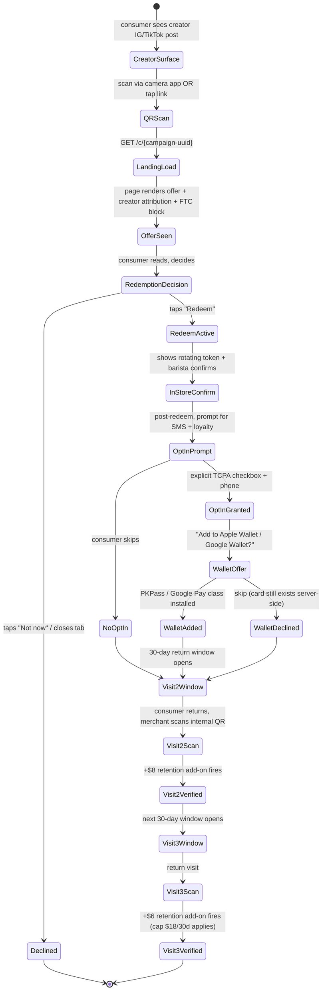

# Consumer-Facing QR Scan + Loyalty — Spec v1

> Canonical spec for the Push consumer surface: the landing page a consumer reaches after scanning a creator- or merchant-surfaced QR code, the redemption flow, the optional SMS opt-in, and the post-visit loyalty loop (visit-2 / visit-3 / Wallet card).
> This is a v1 spec, not an implementation plan. No code lands this sprint.

---

## Header

| Field | Value |
|---|---|
| Status | DRAFT v1 |
| Owner | Z (placeholder — confirm full name + Push email before review cycle) |
| Deliverable date | 2026-05-04 (Day 14 of current sprint) |
| Reviewers | Jiaming (founder, approval), outside privacy counsel (pending per `docs/legal/counsel-engagement-plan.md` §6), Z (primary author) |
| Pre-reads | [`Design.md`](../../Design.md), [`app/(marketing)/page.tsx`](../../app/(marketing)/page.tsx) (live FTC disclosure pattern L1640–L1666), [`.claude/skills/push-attribution/SKILL.md`](../../.claude/skills/push-attribution/SKILL.md), [`.claude/skills/push-pricing/SKILL.md`](../../.claude/skills/push-pricing/SKILL.md) §2.3, [`docs/spec/sms-compliance-v1.md`](./sms-compliance-v1.md) (P2-2 — SMS / TCPA, in drafting), [`docs/v5_2_status/audits/03-legal-compliance-register.md`](../v5_2_status/audits/03-legal-compliance-register.md) |
| Related numeric source of truth | [`docs/v5_2_status/numeric_reconciliation.md`](../v5_2_status/numeric_reconciliation.md) — any per-customer / retention figure quoted here is sourced from that file |
| Code-start trigger (hard gate) | Second paying Beachhead merchant has delivered **≥10 verified customers** (per numeric_reconciliation row 9, Beachhead window is merchants 11–50). Anticipated trigger: v5.3 Week 6 at earliest. See §9. |
| Target launch | v5.3 Week 9 (week of ~2026-07-27 if triggers fire on schedule) |
| Out-of-scope umbrella | See Appendix B. Notable: age-gated categories (alcohol/cannabis/tobacco), merchant-side Wallet pass management UI, multi-merchant universal loyalty card. |

---

## §1. User Journey

The consumer surface is a single-page, session-less experience keyed entirely by `campaign-uuid` in the URL. No consumer account exists. A loyalty card is an opt-in artifact created after redemption and keyed by `phone_hash` (SHA-256 of E.164 + server-side pepper, never the raw phone).

### 1.1 Happy-path state machine



Retention add-on values (visit-2 +$8, visit-3 +$6, loyalty onboarding +$4, cap $18/customer/30-day window) are sourced from `numeric_reconciliation.md` rows 10–13 and `.claude/skills/push-pricing/SKILL.md` §2.3.

### 1.2 Edge cases

| # | Scenario | Expected behavior | Failure mode if mishandled |
|---|---|---|---|
| E1 | Scan from desktop (not phone camera) | Landing renders; "Redeem" CTA shows a QR for the consumer's phone to continue on mobile | Desktop redemption creates orphan tokens |
| E2 | Campaign expired (end_at < now) | Render `/error?reason=expired` with campaign name + "This offer ended on {date}. Find current offers at push.nyc" | Consumer redeems stale offer, merchant declines, bad brand moment |
| E3 | Wrong-geo scan (consumer outside merchant radius) | Allow render, display offer, but gate activation on in-store token (rotating every 90s, validated server-side) | Fake redemption from couch |
| E4 | Offline merchant (no POS / lost internet) | Token remains valid for 10-min offline grace; barista writes last-4 of token on paper, reconciles later | False redemption rate spike |
| E5 | Network failure during opt-in POST | Client buffers opt-in payload; retries 3× with 250ms/1s/4s backoff; on final fail, shows "We couldn't save. Try SMS: text PUSH to 99999" | Silent data loss on the one moment we got explicit consent |
| E6 | Consumer already opted out (phone_hash in `consumer_sms_optout`) | Skip opt-in prompt entirely; still allow loyalty card creation without SMS | TCPA violation if we re-prompt |
| E7 | Pre-existing loyalty card for same merchant+phone_hash | Merge: bump `visit_count`, update `last_visit_at`, reuse `card_uuid`. Never duplicate | Double-counting visits inflates retention add-on |
| E8 | Repeat scan <30 min since last redemption | Idempotent — same `redemption_id` returned; no new visit counted | Per-customer fee double-charged |
| E9 | Creator deplatformed mid-campaign | Landing still renders but attribution byline becomes "Referred via a creator partner" (name redacted); creator payout handled separately per push-creator §5 | Consumer sees "referred by [banned creator]" post-deplatform |
| E10 | Merchant paused mid-campaign | Landing renders with status: "This merchant is not accepting referrals right now. Follow @{creator} for new offers." No token issued | Consumer walks to a closed store |
| E11 | Fraud flag on campaign (`campaign.fraud_flag = true`) | Freeze redemption, show `/error?reason=under_review`, notify ops channel | Fraudulent attribution ships |
| E12 | Consumer self-declares age <13 (COPPA) | Reject loyalty signup, redemption still allowed (anonymous), no SMS prompt | COPPA violation risk |
| E13 | Consumer blocks cookies / Safari ITP | Token is URL-based, not cookie-based. Works. Fallback: local-storage if available | Broken flow on privacy-forward browsers |

### 1.3 Abandonment flows

- **Declines redemption.** No data written beyond anonymous `page_view` event. No creator payout. Consumer can return later via same URL — state is stateless on the server until the consumer opts in to anything.
- **Redeems but skips SMS opt-in.** Visit-1 is still verified and counts toward the creator payout (primary revenue line). No SMS may ever be sent. Visit-2 / visit-3 retention add-ons depend on the merchant's internal QR scan at next visit — no SMS required. This is explicit: **under no circumstance does Push send marketing SMS to a consumer who has not completed the P2-2 TCPA double-opt-in flow**.
- **Redeems, opts in to SMS, declines Wallet.** Card exists server-side at `/loyalty/{card-uuid}`; consumer can access via SMS-delivered magic link on subsequent visits. Wallet can be added later.
- **Adds to Wallet, never returns.** After 24 months of `last_visit_at` inactivity, card auto-deletes per §6 CCPA retention schedule. Wallet pass revokes via push notification from the pass provider.

---

## §2. Pages & States

All routes served from Vercel Edge where SSR-feasible; tokens validated in a Node runtime route handler for KMS signing. Region affinity pinned to `iad1` (US-East) for Wallet signing key co-location.

### 2.1 Route table

| Route | Auth | Render | Cache | Rate-limit class | Region | Error state |
|---|---|---|---|---|---|---|
| `/c/[campaign-uuid]` | None (anonymous) | SSR (Edge) | `s-maxage=60, stale-while-revalidate=300` keyed by campaign_id | `consumer-view`: 60/min/IP | edge-global | Campaign not found → `/error?reason=not_found` |
| `/c/[campaign-uuid]/redeem` | None | CSR on top of SSR shell | `no-store` | `consumer-redeem`: 5/min/IP + 1/min/phone_hash | edge-global → route to `iad1` for token sign | Token sign failure → retry UI |
| `/c/[campaign-uuid]/visit-2` | Signed loyalty token | SSR | `no-store` | `consumer-return`: 10/min/IP | `iad1` | Invalid token → `/error?reason=token_invalid` |
| `/c/[campaign-uuid]/opt-out` | Signed token OR phone+code | CSR | `no-store` | `consumer-optout`: 5/min/IP | `iad1` | Any error → still honor opt-out, log separately |
| `/loyalty/[card-uuid]` | Signed card token | SSR | `no-store` | `loyalty-view`: 30/min/IP | `iad1` | Invalid / revoked → `/error?reason=card_revoked` |
| `/loyalty/[card-uuid]/revoke` | Signed card token | CSR | `no-store` | `loyalty-revoke`: 3/min/IP | `iad1` | Idempotent — second revoke is a no-op |
| `/loyalty/[card-uuid]/wallet.pkpass` | Signed card token | Binary response (Node runtime) | `private, max-age=3600` | `wallet-issue`: 10/day/card | `iad1` | Signing fail → 503 + retry-after |
| `/error` | None | SSR | `s-maxage=300` | `error-view`: 120/min/IP | edge-global | — |
| `/api/internal/verify-scan` | `INTERNAL_API_SECRET` header (per `middleware.ts`) | Node runtime | `no-store` | `internal-verify`: 300/min (shared) | `iad1` | Structured error envelope per `lib/api/responses.ts` |
| `/api/internal/loyalty-events` | `INTERNAL_API_SECRET` | Node runtime | `no-store` | `internal-loyalty`: 300/min | `iad1` | Same |

Rate-limit classes resolve to concrete numbers via `lib/rate-limit/*` (to be added); values above are targets.

### 2.2 Wireframes

All wireframes honor Design.md: Pearl Stone `#f5f2ec` background, Flag Red `#c1121f` primary CTA, Darky headline / CS Genio Mono body, `border-radius: 0` everywhere, 8px base grid.

**`/c/{campaign-uuid}` — Landing**
```
┌─────────────────────────────────────┐
│ [Push wordmark ──────── help link] │ <- 56px header, CS Genio Mono 14
├─────────────────────────────────────┤
│  {Merchant Name}                   │ <- Darky H1 48/56
│  {Offer headline, one line}        │ <- Darky H3 24
│                                    │
│  [Hero image / merchant photo]     │ <- 16:9, sharp corners
│                                    │
│  Referred by @{creator_handle}     │ <- CS Genio Mono 14, link to IG
│  [REDEEM NOW ─────────────]        │ <- Flag Red full-width CTA, 56px
│  Not now                           │ <- text link, graphite
│                                    │
│  FTC disclosure block               │ <- see §6
└─────────────────────────────────────┘
```

**`/c/{campaign-uuid}/redeem` — Active**
```
┌─────────────────────────────────────┐
│ [Push wordmark]                    │
├─────────────────────────────────────┤
│  Show this to the barista          │ <- Darky H2 36
│                                    │
│  ╔═══════════════════════════════╗ │
│  ║  ████████████████████████████ ║ │ <- rotating token, 90s refresh
│  ║  ████  ROTATING TOKEN  ██████ ║ │    sharp black square
│  ║  ████████████████████████████ ║ │    contains last-4 fallback
│  ╚═══════════════════════════════╝ │
│                                    │
│  Countdown: 01:27                  │ <- CS Genio Mono 14
│  Valid at {merchant address}       │
│                                    │
│  [I'M DONE — SHOW LOYALTY]         │ <- leads to opt-in
└─────────────────────────────────────┘
```

**`/c/{campaign-uuid}/visit-2` — Returning consumer**
```
┌─────────────────────────────────────┐
│ [Push wordmark]                    │
├─────────────────────────────────────┤
│  Welcome back.                     │ <- Darky H1
│  This is your 2nd visit to         │
│  {Merchant Name}.                  │
│                                    │
│  [Hero image]                      │
│                                    │
│  Visit 2/3 unlocks:                │ <- CS Genio Mono body
│  • {merchant-configured perk}      │
│                                    │
│  [SHOW BARISTA ────────────]       │ <- Flag Red CTA
│  [View my card]                    │ <- secondary link
└─────────────────────────────────────┘
```

**`/loyalty/{card-uuid}` — Wallet card management**
```
┌─────────────────────────────────────┐
│ [Push wordmark ──────── revoke]    │
├─────────────────────────────────────┤
│  {Merchant Name} card              │ <- Darky H2
│                                    │
│  Visits: ██ ██ ░░                  │ <- sharp squares, filled by count
│                                    │
│  Last visit: {ISO date}            │
│  Referred by @{creator_handle}     │
│                                    │
│  [ADD TO APPLE WALLET]             │ <- Flag Red CTA (sharp 0)
│  [Add to Google Wallet]            │ <- secondary
│                                    │
│  SMS: +1 *** *** 1234              │
│  [Manage SMS] [Delete my data]     │ <- graphite links, under CTA
└─────────────────────────────────────┘
```

**`/error` — Invalid / expired**
```
┌─────────────────────────────────────┐
│ [Push wordmark]                    │
├─────────────────────────────────────┤
│  {Contextual headline by reason}   │ <- Darky H1
│  {Plain-language explanation}      │ <- CS Genio Mono body
│                                    │
│  [FIND CURRENT OFFERS]             │ <- Flag Red CTA → push.nyc
│  support@push.nyc                  │ <- graphite mailto
└─────────────────────────────────────┘
```

---

## §3. Design Tokens

This spec does not redefine tokens. It points to `Design.md` and lists the specific tokens in scope.

### 3.1 Tokens in use

| Token | Value | Scope on consumer pages |
|---|---|---|
| `--surface` (Pearl Stone) | `#f5f2ec` | Page background, all five routes |
| `--primary` (Flag Red) | `#c1121f` | Primary CTA buttons, token border accent |
| `--dark` (Deep Space Blue) | `#003049` | Primary body copy, headline color |
| `--graphite` | `#4a5568` | Secondary / metadata text (timestamps, merchant address) |
| `--line` | `rgba(0, 48, 73, 0.12)` | Dividers, card borders |
| Typography: Darky | per Design.md Type Scale | H1 / H2 / H3 / H4 |
| Typography: CS Genio Mono | per Design.md Type Scale | Body, labels, buttons, captions |
| Border radius | `0` | All elements — CTAs, cards, images, tokens. No exceptions on the consumer surface (map pins 50% rule from Design.md does not apply — no map pins on consumer pages) |

### 3.2 Component reuse

- CTA button style should reuse the class used in `app/(marketing)/page.tsx` hero CTA (sharp corners, Flag Red fill, white text, CS Genio Mono 14px bold). No new CTA variant.
- FTC disclosure section should follow the same structural pattern as `app/(marketing)/page.tsx` L1640–L1666 (role="note", aria-labelledby, asterisk-prefixed body text), but with consumer-appropriate copy (see §6).
- Loyalty "visits" indicator uses sharp-square fill pattern — new component, to be spec'd by Z in v1.1.

### 3.3 Accessibility (WCAG 2.1 AA)

- **Contrast ratio — Flag Red `#c1121f` on Pearl Stone `#f5f2ec`:** approximately **5.3 : 1** (passes AA 4.5:1 for normal text and AA 3:1 for large text / CTA). White text on Flag Red fill: approximately **5.7 : 1** (passes AA). These computed ratios must be re-verified by the implementer using an automated tool (axe, WebAIM) before launch.
- All interactive elements must be keyboard-reachable and have a visible focus outline (2px `--primary` offset-2).
- Rotating redemption token must be announced to screen readers at every refresh (aria-live="polite") with token last-4 as text.
- Dynamic content (countdown timers) must not refresh more often than 5s at the screen-reader layer.

---

## §4. Data Model Additions

These tables are **spec only**. No migrations land this sprint. Field types target PostgreSQL via Supabase. All three tables contain PII or PII-derived fields and are subject to CCPA/GDPR deletion requests — retention schedule in §6.

```sql
-- ============================================================
-- consumer_visits
-- PII boundary: phone_hash (SHA-256 of E.164 + server pepper)
-- Retention: 24 months from last row per phone_hash × merchant_id,
--   then auto-delete via scheduled job.
-- ============================================================
CREATE TABLE consumer_visits (
  id                BIGSERIAL PRIMARY KEY,
  campaign_id       UUID        NOT NULL REFERENCES campaigns(id) ON DELETE RESTRICT,
  merchant_id       UUID        NOT NULL REFERENCES merchants(id) ON DELETE RESTRICT,
  creator_id        UUID        REFERENCES creators(id) ON DELETE SET NULL,
  consumer_phone_hash  BYTEA    NOT NULL,  -- 32 bytes, SHA-256(E.164 || pepper)
  visit_timestamp   TIMESTAMPTZ NOT NULL DEFAULT now(),
  visit_number      SMALLINT    NOT NULL CHECK (visit_number BETWEEN 1 AND 10),
  verified          BOOLEAN     NOT NULL DEFAULT false,
  verification_source TEXT      NOT NULL CHECK (
    verification_source IN ('qr_scan','merchant_manual','internal_override')
  ),
  token_last4       CHAR(4),    -- audit trail only
  created_at        TIMESTAMPTZ NOT NULL DEFAULT now()
);

CREATE INDEX idx_visits_phone_merchant ON consumer_visits (consumer_phone_hash, merchant_id, visit_timestamp DESC);
CREATE INDEX idx_visits_campaign ON consumer_visits (campaign_id, visit_timestamp DESC);
CREATE INDEX idx_visits_creator_verified ON consumer_visits (creator_id, verified, visit_timestamp DESC)
  WHERE verified = true;

-- ============================================================
-- loyalty_cards
-- PII boundary: phone_hash + card_uuid (treated as secret)
-- Retention: 24 months inactive (last_visit_at) → auto-delete
-- ============================================================
CREATE TABLE loyalty_cards (
  card_uuid         UUID        PRIMARY KEY DEFAULT gen_random_uuid(),
  consumer_phone_hash  BYTEA    NOT NULL,
  merchant_id       UUID        NOT NULL REFERENCES merchants(id) ON DELETE CASCADE,
  creator_id        UUID        REFERENCES creators(id) ON DELETE SET NULL,
  created_at        TIMESTAMPTZ NOT NULL DEFAULT now(),
  visit_count       SMALLINT    NOT NULL DEFAULT 1 CHECK (visit_count >= 1),
  last_visit_at     TIMESTAMPTZ NOT NULL DEFAULT now(),
  sms_opt_in        BOOLEAN     NOT NULL DEFAULT false,
  sms_opt_in_at     TIMESTAMPTZ,
  sms_opt_in_ip     INET,       -- TCPA audit trail
  sms_opt_in_ua     TEXT,
  revoked_at        TIMESTAMPTZ,
  CONSTRAINT uq_merchant_phone UNIQUE (merchant_id, consumer_phone_hash)
);

CREATE INDEX idx_cards_last_visit ON loyalty_cards (last_visit_at)
  WHERE revoked_at IS NULL;
CREATE INDEX idx_cards_phone ON loyalty_cards (consumer_phone_hash);

-- ============================================================
-- wallet_pass_meta
-- PII boundary: indirect (links to loyalty_cards).
-- Retention: cascades with loyalty_cards.
-- ============================================================
CREATE TABLE wallet_pass_meta (
  card_uuid            UUID PRIMARY KEY REFERENCES loyalty_cards(card_uuid) ON DELETE CASCADE,
  apple_pass_type_id   TEXT,                -- pass.nyc.push.loyalty.{merchant_slug}
  apple_serial_number  TEXT UNIQUE,         -- unique per pass
  apple_auth_token     TEXT,                -- used for web-service auth from device
  apple_issued_at      TIMESTAMPTZ,
  google_pass_class_id TEXT,                -- 3388000000022xxxx.{merchant_slug}
  google_object_id     TEXT UNIQUE,
  google_issued_at     TIMESTAMPTZ,
  last_update_at       TIMESTAMPTZ NOT NULL DEFAULT now()
);
```

**PII-hashing note.** `phone_hash` = `SHA-256(E.164_phone || server_pepper)`. Pepper is a 32-byte random value stored in the `SUPABASE_SERVICE_ROLE_KEY`-adjacent secret `CONSUMER_PHONE_PEPPER`, rotated at most yearly with a versioned column added at rotation (`phone_hash_v` tinyint). The raw phone number is never persisted to the database. It lives only in transit: inbound from the opt-in form, outbound to Twilio for SMS send. Twilio messaging logs are the system of record for raw phone.

**Hot-query access pattern.** The primary lookup is "does a loyalty card exist for this phone × this merchant?" — satisfied by `uq_merchant_phone` unique constraint. Secondary: "how many visits in the last 30 days for this phone × this merchant?" — `idx_visits_phone_merchant` covers this.

**RLS.** These tables live on the service-role schema per `lib/db/index.ts`; RLS is not the protection boundary. All reads/writes go through `lib/services/consumer/*.ts` which enforces phone-hash-only access. No anon client may touch these tables.

---

## §5. Integration Points

### 5.1 Apple Wallet (PKPass)

| Attribute | Value |
|---|---|
| Vendor account | Apple Developer Program — $99/yr |
| SDK / reference | [developer.apple.com/wallet](https://developer.apple.com/wallet/) + PKPass spec |
| Auth model | P.12 pass signing certificate + WWDR intermediate cert; per-merchant `passTypeIdentifier` (e.g., `pass.nyc.push.loyalty.merchant-slug`) |
| Rate limits / quota | Pass issuance: no hard Apple limit, but signing throughput is CPU-bound — budget 100 passes/sec per instance; Month-6 target ≤5k new passes/mo is well within capacity |
| Error handling | Signing failure → 503 with `retry-after`; device registration failure → log + best-effort retry on next update |
| Observability | Log every pass issue, update, register, unregister; alert if issue-success-rate <98% over 1-hour window |
| Security | P.12 private key in Vercel encrypted env var; rotation plan: annual or on compromise; pass web-service endpoint HTTPS-only, enforces `ApplePass` auth scheme |
| Hidden dependency | **Apple Developer account approval can take 2–10 business days** and requires DUNS number + legal-entity name verification. Start the application day 1 of v5.3 Week 1, not Week 5. Log in Appendix A. |

### 5.2 Google Wallet

| Attribute | Value |
|---|---|
| Vendor account | Google Pay & Wallet Console — free |
| SDK / reference | [developers.google.com/wallet](https://developers.google.com/wallet) — Generic / Loyalty pass class |
| Auth model | Service account JSON (Google Cloud IAM) with `wallet_object.issuer` role; signed JWT with `aud="google"`, `iss=service_account_email` |
| Rate limits / quota | Issuer API: 100 QPS default; request quota increase before Month-6 if projected issuance >20k/mo |
| Error handling | Signed JWT failure → log + show user "Try again"; class update conflict → exponential backoff, max 5 retries |
| Observability | Log class update, object create, device install callbacks |
| Security | Service account JSON in Vercel encrypted env var; `aud` claim pinned to `google`; restrict JWT signing to `/api/internal/*` routes |
| Hidden dependency | **Google Pay Issuer account approval typically 5–15 business days**; requires existing Apple Wallet pass as "parity reference" per Google reviewer guidance (anecdotal — confirm). |

### 5.3 SMS (Twilio)

| Attribute | Value |
|---|---|
| Vendor account | Twilio — ~$0.0075/SMS (US) + $1/mo Messaging Service + A2P 10DLC brand/campaign registration fee |
| SDK / reference | [twilio.com/docs/messaging](https://www.twilio.com/docs/messaging) |
| Auth model | Account SID + Auth Token; rotate Auth Token on any suspected leak |
| Rate limits / quota | A2P 10DLC tier-based; Month-6 estimated 5k SMS/mo (well within any tier) |
| Error handling | 4xx = drop + log; 5xx = retry with exponential backoff (max 3); delivery failure → do NOT auto-retry (carrier-blocked) |
| Observability | Log every send with `phone_hash` (not phone); alert on delivery-success-rate <95% over 1-hour window |
| Security | Webhook signature validation on inbound (STOP/HELP); TLS-only; no raw phone logged to our systems — delegated to Twilio console |
| Hidden dependency | **A2P 10DLC brand registration takes 3–10 business days**; campaign registration another 3–5. This is a long pole. Block on this by day 1 of v5.3 Week 1. |
| Compliance | Gated on P2-2 (docs/spec/sms-compliance-v1.md). **No SMS may be sent until P2-2 ships and the TCPA double-opt-in flow is live.** |

---

## §6. Compliance

### 6.1 TCPA (SMS)

Hard dependency on P2-2 `docs/spec/sms-compliance-v1.md`. This spec commits to: (a) explicit, unchecked opt-in checkbox in the opt-in UI; (b) immediate confirmation SMS with STOP/HELP language; (c) opt-in metadata stored in `loyalty_cards` (ip, UA, timestamp) as legal audit trail; (d) no marketing SMS ever sent pre-opt-in.

### 6.2 CCPA / CPRA

- **Right to delete:** `/loyalty/{card-uuid}/revoke` hard-deletes the `loyalty_cards` row and cascades `wallet_pass_meta`. `consumer_visits` rows are retained in anonymized form (phone_hash zeroed, `visit_number` preserved for creator payout audit trail) for 7 years per financial-record retention policy — to be confirmed with counsel.
- **Retention schedule:**
  - `loyalty_cards` with no activity for **24 months** (per `last_visit_at`) → auto-delete via nightly job, cascades wallet pass meta.
  - `consumer_visits` rows: kept 24 months live; after that, `consumer_phone_hash` zeroed but the aggregate row is preserved for campaign-level analytics and creator payout audit.
- **Do-not-sell:** Push does not sell consumer PII. "Do Not Sell My Personal Information" link in the footer is future-state (post-Series-A marketing growth).
- **Privacy policy:** must be updated before consumer page launches. Owner: founder + privacy counsel. Tracked in `docs/v5_2_status/audits/03-legal-compliance-register.md` row 20 (Supabase DPA) and must include consumer-specific retention language.

### 6.3 FTC 16 CFR § 255 (endorsement guide)

At every creator-attribution surface on the consumer pages, render the disclosure:

> **Consumer was referred by [Creator]. Creator may be compensated per verified visit.**

This is required on: `/c/{campaign-uuid}` (prominent, above the redeem CTA), `/c/{campaign-uuid}/redeem` (footer of the page, below the rotating token), `/loyalty/{card-uuid}` (in the "Referred by" metadata row), `/c/{campaign-uuid}/visit-2` (footer). The existing FTC block on `app/(marketing)/page.tsx` L1640 addresses illustrative marketing numbers — that is a different disclosure and does not replace this one. Cross-reference: `docs/v5_2_status/audits/03-legal-compliance-register.md` §Marketing/Advertising row 3 (landing FTC disclosure, shipped 2026-04-20).

### 6.4 NYC Local Law 144 (AEDT)

Consumer pages do not make employment or credit decisions → **out of scope.** If a future iteration adds "auto-VIP" tier decisions based on consumer behavior, LL-144 would re-attach and bias-audit requirements would apply. Flag logged in Appendix B.

### 6.5 PCI-DSS scope

The redemption flow does not handle card PAN at any point. Merchant accepts payment out-of-band via their existing POS. Push remains **out of PCI scope**. Enforcement: explicitly prohibit any "pay with card" feature in this product surface. If added later, scope impact must be re-assessed before shipping.

### 6.6 Accessibility (WCAG 2.1 AA)

Required: keyboard-only flow passes redemption and opt-in end-to-end; VoiceOver / TalkBack can read the rotating token and the FTC disclosure; contrast ratios verified per §3.3. Pre-launch: run `axe-core` on all five routes and fix any AA violations.

### 6.7 Age gating (COPPA)

Self-declaration checkbox at opt-in: "I am 13 or older." Users under 13 cannot create a loyalty card or opt in to SMS; redemption remains available anonymously. For merchants in age-restricted categories (alcohol, cannabis, tobacco), **v0 is not shipping any consumer flow** — see Appendix B item 7. Those categories require ID-scan verification and state-by-state legal review, deferred to v1.

---

## §7. Timeline

| Date / Window | Milestone | Gate |
|---|---|---|
| 2026-05-04 (Day 14) | Spec v1 finalized, reviewed by Z + Jiaming; privacy counsel pre-read scheduled | Spec approval |
| 2026-05-05 to ~2026-06-01 (v5.3 Weeks 1–4) | **No consumer code.** Focus: ML Advisor onboarding + pilot dependencies. In parallel: start Apple Developer account, Google Pay Issuer account, Twilio A2P 10DLC registration (long-pole approvals — see §5) | ML Advisor engaged |
| ~2026-06-02 (v5.3 Week 5) | Code work starts **only if** code-start trigger (§9) fires. Implementation kick-off by Z | Trigger met |
| v5.3 Weeks 5–8 | Implementation + internal testing + privacy counsel legal review of consumer pages + accessibility audit | Counsel sign-off, axe-core clean |
| ~2026-07-27 (v5.3 Week 9) | Launch with Apple Wallet integration active; Google Wallet in parallel track if Issuer-account approval landed | First live consumer redemption with Wallet card |
| v5.3 Week 10+ | Google Wallet GA, loyalty tier evolution, optional merchant-side loyalty dashboard | Product-led from Beachhead expansion learnings |

Dates are calendar targets; the Week-5 start is contingent on §9. Slippage beyond Week 11 launch requires founder escalation.

---

## §8. Owner & Working Group

| Role | Person | Responsibility |
|---|---|---|
| Primary owner | **Z** (placeholder — confirm name + Push email on Day 2 of sprint) | Spec drives, review, implementation lead |
| Founder review / approval | Jiaming | Final sign-off, product + legal escalation |
| Ops liaison | Prum | Merchant onboarding implications, pilot-merchant recruitment for Week 4 check-ins |
| Creator-ops liaison | Milly | Creator-attribution surface copy, creator deplatform edge case (E9) |
| ML Advisor (technical) | TBD via `docs/hiring/ml_advisor_outreach_tracker.md` | Verification pipeline alignment, fraud signal integration |
| Legal | Outside privacy counsel | FTC / TCPA / CCPA / COPPA review; engagement pending per `docs/legal/counsel-engagement-plan.md` §6 |
| Escalation path | Founder (Jiaming) if Week 9 launch slips >2 weeks, if counsel flags a blocker, or if either Wallet provider rejects the issuer application |

---

## §9. Trigger (hard gate to start code)

**All three conditions must be met before a single PR lands on the consumer-facing implementation:**

1. Second paying Beachhead merchant has delivered **≥10 verified customers** (per numeric_reconciliation row 9; Beachhead window is merchants 11–50).
2. Loyalty flow has been validated verbally with **≥2 of the original pilot merchants** at their Week 4 check-in — specifically, they confirm (a) a loyalty card would reduce their churn risk, (b) they would display a visit-2 QR at register, and (c) they accept the compliance posture (FTC disclosure on-premise signage).
3. P2-2 (SMS TCPA) spec has passed outside legal review — draft + redline cycle closed.

**Anticipated fire date:** v5.3 Week 6 at earliest (week of ~2026-07-06 on the current calendar). If any of the three conditions has not landed by Week 7, founder must call a go/no-go — slipping past Week 7 means the Week 9 launch target slips by the same margin.

---

## Appendix A. Open Questions

Each: question, owner to resolve, deadline, what-if-unresolved default.

1. **Confirm primary owner name.** Question: who is "Z"? Owner to resolve: Jiaming. Deadline: 2026-04-22 (Day 3 of sprint). Default if unresolved: escalate, block spec review cycle.
2. **Rotating token refresh cadence.** Question: 60s, 90s, or 120s refresh? Owner: Z + ops (fraud/friction tradeoff). Deadline: 2026-04-29. Default: 90s.
3. **Token last-4 vs full.** Question: do we show last-4 for merchant manual-entry fallback, or insist on scan-only? Owner: Milly (creator-ops / merchant feedback). Deadline: 2026-05-01. Default: show last-4.
4. **Offline grace window.** Question: 10-min grace on offline merchant network failure — is 10 correct? Owner: Prum. Deadline: 2026-05-01. Default: 10 min, with reconcile job every hour.
5. **consumer_visits retention after 24 months.** Question: zero out `phone_hash` and keep the aggregate row for 7-year financial retention, or hard-delete at 24 months? Owner: founder + privacy counsel + fractional CFO. Deadline: 2026-05-04. Default: zero out, keep aggregate.
6. **Multi-merchant loyalty collision.** Question: if a consumer has 5 merchant loyalty cards, do we show a "Push wallet hub" view or keep each card isolated? Owner: Z. Deadline: v1 out of scope, revisit v1.1. Default: isolated (each card independent).
7. **COPPA self-declaration UX.** Question: is "I am 13 or older" checkbox sufficient, or do we need a birthdate field? Owner: privacy counsel. Deadline: 2026-05-04. Default: checkbox (counsel to confirm).
8. **Apple Developer DUNS registration owner.** Question: whose name is on the DUNS + Apple Developer agreement? Owner: founder. Deadline: 2026-04-27 (long-pole: 2–10 business days for Apple approval). Default: founder personally, transfer to Push, Inc. once corporate entity ready.
9. **Google Pay Issuer account — Apple parity.** Question: does Google actually require an existing Apple Wallet pass as reference, or is this apocryphal? Owner: Z. Deadline: 2026-05-01 (research). Default: ship Apple first, Google second, to be safe.
10. **Rate-limit class number values.** Question: the §2.1 table gives classes; concrete QPS numbers to be written in `lib/rate-limit/*`. Owner: Z. Deadline: v5.3 Week 5. Default: numbers in table as-targets.
11. **Token signing key custody.** Question: where does the token HMAC key live — env var, AWS KMS, GCP KMS? Owner: Z + founder. Deadline: 2026-05-04. Default: env var with quarterly rotation, KMS post-Series-A.
12. **FTC disclosure placement above the fold.** Question: is "above the redeem CTA" sufficient, or must it be above the hero image? Owner: privacy counsel. Deadline: 2026-05-04. Default: above CTA, below hero.

## Appendix B. Out of Scope for v0

Each: item, why deferred, when to revisit, owner.

1. **Merchant-side Wallet pass management UI.** Merchants will not have a UI to customize their own PKPass appearance in v0 — Push ops configures per merchant. Why deferred: adds merchant-onboarding complexity without Month-6 demand signal. Revisit: Month 9. Owner: Prum.
2. **Multi-merchant universal loyalty card.** A single Push-branded wallet with all merchant punches. Why deferred: needs design work on brand conflict (Push vs merchant identity on the pass face) + requires a PKPass/Google pass class we haven't designed. Revisit: Month 12. Owner: Z.
3. **Tiered loyalty (visit-5+, permanent VIP).** Why deferred: no evidence yet that visit-5+ is common enough to matter; retention add-on caps at visit-3. Revisit: after 90 days of visit-3 data. Owner: founder (metrics-driven).
4. **Consumer account / persistent sign-in.** Why deferred: adds registration friction, contradicts "zero consumer ops burden" principle in push-attribution §1. Revisit: only if data shows consumers actively want it. Owner: Z.
5. **Desktop-primary flow.** Why deferred: 97%+ of creator content is consumed on mobile; desktop is a fallback, not a primary surface. Revisit: not planned. Owner: Z.
6. **Non-English consumer UI.** Why deferred: Williamsburg / NYC pilot is English-primary. Revisit: first non-English-primary neighborhood expansion (potentially Chinatown, Sunset Park). Owner: Milly.
7. **Age-restricted merchant categories (alcohol, cannabis, tobacco).** Why deferred: state-by-state regulation + ID-scan requirement is a 10x spec. Revisit: Month 12+ with legal pre-work. Owner: founder + regulatory counsel.
8. **Consumer-initiated complaint / dispute flow.** Why deferred: v0 assumes merchant/barista resolves issues at register. Consumer disputes flow through `support@push.nyc` email, manual. Revisit: if support ticket volume >10/wk. Owner: Prum.
9. **In-product merchant "pause campaign" UI.** Merchant asks Push ops to pause. Why deferred: merchant portal does not yet support this; in-product is downstream. Revisit: Q4 2026 merchant portal refresh. Owner: Prum.
10. **Consumer "Do Not Sell My Personal Information" link.** Why deferred: we do not sell PII today; CCPA compliance achievable without the link for pre-revenue-threshold businesses. Revisit: on CCPA revenue threshold crossing or multi-state expansion. Owner: privacy counsel.

## Appendix C. Risk Register

| # | Risk | Likelihood | Impact | Mitigation | Owner |
|---|---|---|---|---|---|
| R1 | Apple Developer / Google Pay Issuer approval slips past Week 4, blocking Wallet integration at launch | M | H | Start applications Week 1, not Week 5; ship without Wallet as fallback (web-based loyalty card view) | Z |
| R2 | Twilio A2P 10DLC brand/campaign registration rejected or stalled | M | H | Start registration Week 1; if rejected, fall back to transactional-only SMS or delay SMS entirely (loyalty works without SMS) | Z |
| R3 | Outside privacy counsel flags TCPA / COPPA blocker during Week 5–8 review | L | H | Counsel pre-read in Week 1; design with counsel templates from `docs/legal/counsel-engagement-plan.md` | Jiaming + counsel |
| R4 | Fraud — consumer spoofs rotating token via screen-share | L | M | Server-side token validation with merchant-specific nonce + geo-fence; in-store-only redemption; audit log every validation | Z |
| R5 | Phone hash collision or pepper compromise | L | H | 32-byte random pepper with versioned column (`phone_hash_v`) for rotation; pepper stored in Vercel encrypted env, access audited | Z |
| R6 | Wallet pass serial-number collision across merchants | L | M | Uniqueness enforced at DB layer (`apple_serial_number UNIQUE`); issuance via UUID, collision probability negligible | Z |
| R7 | Merchant-paused mid-campaign consumer hits landing (E10) and walks to a closed store | M | M | Landing polls campaign status on render (SSR) and refreshes every 60s on foreground; show "not accepting" banner | Z |
| R8 | CCPA deletion request lands before retention-job lifecycle tested | L | M | Manual deletion runbook shipped with v0 launch; automation in v1.1 | Prum |
| R9 | Consumer opens `/loyalty/{card-uuid}` on a shared device, exposing card to next user | M | L | Card view is read-only, does not show raw phone; "Delete my data" always visible; 15-min idle auto-logout on the SSR token | Z |
| R10 | Creator deplatformed during active loyalty cards still reference their handle in `/loyalty/{card-uuid}` UI | M | L | On deplatform, redact creator name in all consumer-facing surfaces within 24h; `creator_id` remains in DB for payout audit trail per E9 | Milly |
| R11 | Launch slips past v5.3 Week 11 | M | M | §9 go/no-go by Week 7; if slipping, pull in Prum + Milly to manually simulate loyalty flow (printed-card fallback) for first 2 Beachhead merchants | Jiaming |
| R12 | Privacy policy update for consumer pages lags the launch | M | H | Policy draft owned in Week 1; counsel redline Week 3; no code ships to production without policy live | Jiaming + counsel |

---

*End of spec v1.*
