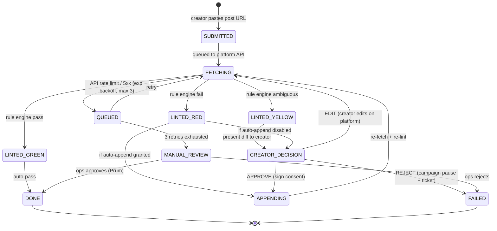

# DisclosureBot v0 — Rule-Based FTC § 255 Disclosure Enforcement (Spec)

**Status:** DRAFT v0 — rule-based only. ML-based "clear and conspicuous" judgment and video OCR are explicitly out of scope and scheduled for v1 once ML Advisor is on staff and ≥3 months of v0 production data are available.
**Owner:** Z (engineering, sole owner through v5.3 W2) → joint ownership with ML Advisor from v5.3 W3 onward.
**Deliverable date:** 2026-05-04 (spec Day 14) · code v5.3 W5 · launch v5.3 W10 (before first pilot post goes live).
**Reviewers:** Z, ML Advisor (post-onboard), outside FTC counsel (REQUIRED pre-launch — §8.1 opinion letter is a hard gate), Jiaming.
**Pre-reads:** 16 CFR §§ 255.0 through 255.5 (FTC Endorsement Guides) in full; FTC 2023 "Endorsement Guides: What People Are Asking"; Instagram Graph API (Business Content) + TikTok for Business Content Posting API v2; [`docs/legal/counsel-engagement-plan.md`](../legal/counsel-engagement-plan.md) §7 Marketing/FTC; [`docs/v5_2_status/audits/03-legal-compliance-register.md`](../v5_2_status/audits/03-legal-compliance-register.md) §Marketing/Advertising/FTC; [`.claude/skills/push-creator/SKILL.md`](../../.claude/skills/push-creator/SKILL.md) §5.5 (NYC LL-144 parallel compliance pattern).
**Hard gate:** No DisclosureBot output reaches a creator, merchant, or post until outside FTC counsel delivers a written opinion letter covering (a) rule-set sufficiency, (b) auto-append legality, and (c) consent-signature sufficiency. See §8.1.

---

## §1. Purpose & Regulatory Basis

### 1.1 Why this system exists

Every creator post inside a Push-paid campaign must carry an FTC-compliant disclosure. Push pays creators for posts about merchants, which creates a **material connection** between the endorser (creator) and the advertiser (merchant + Push as payer-of-record). Under 16 CFR § 255.5, that material connection triggers a mandatory "clear and conspicuous" disclosure. DisclosureBot is the platform-level control that audits every pilot post for compliant disclosure, auto-remediates simple cases, and escalates ambiguous ones, before the post is counted toward a campaign's verified-customer total.

### 1.2 Regulatory framework

- **16 CFR § 255.0 ("Purpose and definitions").** Defines "endorsement" as any advertising message that consumers would likely believe reflects the opinions or experiences of a party other than the sponsoring advertiser. A paid creator post that describes a product experience is an endorsement.
- **16 CFR § 255.1 ("General considerations").** Endorsements must reflect the endorser's honest opinion. Connected parties (creators paid by Push) cannot claim an experience they did not have.
- **16 CFR § 255.5 ("Disclosure of material connections").** The core rule for DisclosureBot: when a material connection exists between endorser and advertiser that consumers would not expect, the connection must be disclosed clearly and conspicuously.
- **FTC 2023 "Endorsement Guides: What People Are Asking" (updated guidance).** Key operational points: disclosure must be understandable in the first 3 seconds of exposure; cannot be hidden behind a "more" expand, a hover tooltip, or a hyperlink; cannot live only in a profile bio; must be in the same language the endorsement is written in; the word "ad" alone is acceptable but "#ambassador" or "#thanks" alone is not.
- **FTC Act § 5 ("Unfair or deceptive acts or practices").** Missing disclosure of a material connection is a § 5 violation. As of 2024, civil penalties run up to $51,744 per violation for knowing violations by parties subject to prior orders.
- **Platform secondary liability.** The FTC has pursued platforms that knew of widespread non-compliance by their creators and did not act (CSGO Lotto; Warner Bros.; Lord & Taylor). A platform that builds a rule-based disclosure system, documents audit trails, and escalates known failures materially reduces this exposure.
- **State "little FTC acts."** NY GBL § 349, CA Civil Code § 1770, FL FDUTPA, and peers parallel federal FTC authority and stack per-violation civil damages. NY AG in particular has pursued influencer-marketing cases (Devumi, CSGO Lotto). For Push's NYC-first footprint, NY GBL § 349 exposure is the most immediate state-level concern.

### 1.3 Existing Push footprint

Push already ships FTC § 255 disclosure language on `/` (portal) and `/(marketing)` (public landing) — see [`app/page.tsx:337-396`](../../app/page.tsx) and [`app/(marketing)/page.tsx:1640-1663`](../../app/(marketing)/page.tsx). Those are *illustrative-numbers* disclosures ("the figures on this page are modeled, not customer-sourced"). DisclosureBot is different: it governs the *creator's* disclosure of the material connection on the creator's own post, on a third-party platform (Instagram or TikTok), after Push has paid the creator.

A minimal keyword-based check already lives at [`app/api/creator/disclosure/check/route.ts`](../../app/api/creator/disclosure/check/route.ts). DisclosureBot v0 supersedes that endpoint: v0 adds prominence scoring, first-100-char / first-4-hashtag linting, auto-append, consent capture, and a full audit log. The existing route becomes the thin wrapper that calls into the new service (`lib/services/disclosure/*`).

### 1.4 Scope of v0 (explicit non-goals)

v0 ships the text-only rule engine. The following are v1 — see §7 for triggers:
- Video audio-track transcription / ASR (Whisper or equivalent) to detect spoken disclosures.
- Image-overlay OCR for in-frame disclosure text.
- ML judgment of "clear and conspicuous" when text is present but ambiguous.
- Languages other than English.
- YouTube Shorts (mentioned in §6 for roadmap; not v0).

---

## §2. v0 Rule Engine

Deterministic. Zero ML. Every decision is reproducible from caption text, a rule-engine version, and a commit hash. Output is one of `GREEN` / `YELLOW` / `RED`; see the state machine in §3.

### 2.1 Lint target

The linter examines **the first 100 characters of the caption OR the first 4 hashtags, whichever contains more tokens** (tokens = whitespace-delimited words plus hashtags). Rationale: Instagram and TikTok both truncate captions with a "more" link; FTC 2023 guidance explicitly rejects disclosure hidden behind a "more" expand. Text outside this lint window is scanned only to flag the "disclosure-too-late" failure mode in §2.5.

### 2.2 Required literal tokens (any one satisfies)

Presence of any of the following in the lint window (case-insensitive, matched on word / hashtag boundaries, not as substrings of other tokens) produces a **GREEN** result subject to the prominence and sequence checks below:

| Class | Token | Match rule |
|---|---|---|
| Hashtag | `#ad` | Hashtag boundary; `#adult`/`#address` do not match |
| Hashtag | `#sponsored` | Hashtag boundary |
| Hashtag | `#paidpartnership` or `#paid_partnership` | Either spelling |
| Phrase | "paid partnership" | Word-boundary phrase match |
| Phrase | "in partnership with" | Word-boundary phrase match |
| Phrase | "sponsored by" | Word-boundary phrase match |
| Phrase | "paid ad" | Word-boundary phrase match |
| Phrase | "paid promotion" | Word-boundary phrase match |
| Platform flag | Instagram Branded Content tag | Read via Instagram Graph API post metadata (`branded_content` field); not a caption-text match |

Tokens *not* accepted in v0 (treated as insufficient; see Appendix B checklist):
- `#spon` (ambiguous abbreviation; FTC 2023 guidance calls out abbreviations as risky — v0 rejects; v1 may revisit with counsel sign-off).
- `#ambassador` / `#partner` / `#collab` alone (insufficient per FTC 2023 guidance — these signal an affiliation but do not disclose payment).
- `#thanks` / `#gifted` alone (FTC requires the consumer to understand there is an advertising relationship; `#gifted` alone is under active FTC scrutiny).
- Disclosure in creator's bio only, with no disclosure on the post (FTC 2023 explicitly calls this insufficient).

### 2.3 Auto-append fallback

If the lint window contains no required token and the Instagram Branded Content flag is not set, DisclosureBot v0 auto-appends the literal suffix `(#ad via @push_local)` to the caption via the platform API write (Instagram Graph API caption edit, TikTok Content Posting API metadata update). The auto-append requires an explicit creator grant recorded in the consent signature — see §2.4 and §3. If the creator has not granted auto-append, the post flows to `CREATOR_DECISION` state instead.

The literal suffix is deliberately brand-neutral: `(#ad via @push_local)` names Push once (so any reader can trace the relationship to the platform) and uses `#ad` as the FTC-canonical minimum disclosure. The `via @push_local` clause is informational, not the disclosure itself — the disclosure is `#ad`.

### 2.4 Strict-mode flag (per-campaign)

Each campaign carries a `disclosure_strict_mode` boolean on the campaigns row. When strict mode is on:
- Auto-append is **disabled**. Missing disclosure produces a `RED` result and pauses the campaign for that creator until the creator edits the post.
- Consent signature is required at campaign enrollment, not post-by-post.
- Any `YELLOW` result (see §2.5) also pauses for manual review.

Strict mode is the default for any campaign flagged `high_liability` (e.g., health / financial / children-targeted categories). Non-strict mode is the default for general-market campaigns. Strict-mode flag is decided by Jiaming + counsel at campaign-template creation; the flag is immutable once the campaign has live posts.

### 2.5 Disclosure sequence (prominence)

Two additional tests run after §2.2 matches:

**Prominence test.** The match must fall within the lint window (§2.1). A disclosure at character 800 of a 1200-character caption fails — it would not appear above the "more" fold on Instagram mobile, violating FTC 2023 "first 3 seconds" guidance. If the token exists in the caption but outside the window, the result is `YELLOW` with the reason `disclosure_buried`.

**Sequence test.** The disclosure must precede or immediately accompany the primary product claim. "Precede" = appears before the first merchant brand mention or product-benefit phrase in the lint window. If a creator writes "This sauce changed my life. #ad" the disclosure is at the end of the claim — this is a borderline pass per FTC 2023 guidance but returns `YELLOW` with reason `disclosure_trails_claim` for human review. If the disclosure is separated from the claim by 50+ characters of unrelated content, the result is `RED`.

### 2.6 Result grades

- **GREEN.** Token present, prominent, sequenced. No action; log and proceed.
- **YELLOW.** Token present but one of: buried outside lint window, trails claim by a borderline amount, multiple disclosures with inconsistent content, non-English disclosure in an English caption (v0 cannot verify). Route to `CREATOR_DECISION`.
- **RED.** No token present, or token is on the reject list (§2.2), or severe sequencing failure. If auto-append is permitted (§2.3 / §2.4), append and re-lint — if the re-lint returns GREEN the audit log records `auto_remediated`. Otherwise pause campaign and open a support ticket.

---

## §3. Creator-Side Flow (state machine)



### 3.1 State definitions

- **SUBMITTED.** Creator pastes their public post URL into the Push creator portal. Row inserted into `disclosure_audit_log` with status `submitted`.
- **FETCHING.** Server-side worker fetches the post via the platform API (§6). Content hash (SHA-256 of caption + asset URLs + posted timestamp) is computed and recorded.
- **LINTED.** Rule engine (§2) runs against the fetched caption. Records the matched rule (or none), prominence, sequence.
- **CREATOR_DECISION.** Creator sees a diff: "Your caption currently reads … we recommend appending `(#ad via @push_local)`." Three buttons: `APPROVE`, `EDIT`, `REJECT`.
- **APPROVE branch.** Creator clicks approve → signs consent record (content_hash + disclosure_version + UTC timestamp + signature token). The consent record is the audit trail's legal-weight artifact; it attests that the creator authorized Push to edit the caption on the platform in service of FTC compliance.
- **EDIT branch.** Creator chooses to edit the caption themselves on the platform. DisclosureBot waits a configurable window (default 15 minutes) and re-fetches; any result returns to `LINTED`.
- **REJECT branch.** Creator refuses any disclosure. Campaign is `PAUSED` for that creator; a support ticket opens at `@prum` on ops; this is a **hard fault**, not a soft fail — creators who refuse disclosure cannot participate in Push campaigns until resolved with counsel.
- **APPENDING.** DisclosureBot writes the auto-append string via platform API. On success, re-fetches to verify the edit is live; on failure, routes to `MANUAL_REVIEW`.
- **QUEUED / MANUAL_REVIEW.** Rate-limit and API-outage paths. MANUAL_REVIEW is owned by Prum on ops.
- **DONE / FAILED.** Terminal states. Both are preserved in the audit log indefinitely.

### 3.2 Creator-facing disclosure sequence language

The consent dialog surfaced at `CREATOR_DECISION` reads (subject to counsel sign-off per §8.1):

> Push is required by the FTC (16 CFR § 255) to ensure your post clearly discloses that this is a paid partnership. Your current caption does not appear to meet this requirement. If you approve, Push will append the text `(#ad via @push_local)` to your caption via Instagram's / TikTok's official API. By clicking Approve, you authorize this edit for this post only, and your consent signature will be stored as a legal audit record. You can also edit the caption yourself, or reject and exit this campaign.

### 3.3 Creator-consent signature

The `creator_consent_signature` stored on the audit log is a server-generated HMAC over:
```
creator_id || post_url || content_hash || disclosure_version || utc_timestamp
```
signed with a key held only by the server. The creator's action (Approve) is the authorization; the HMAC is a tamper-evident record that the authorization happened at that timestamp for that exact content. This is the audit-evidence format §8.1 asks counsel to bless.

---

## §4. Audit Log Schema (DDL)

### 4.1 Primary audit table

```sql
-- Retain indefinitely — FTC enforcement statute-of-limitations is typically 3
-- years (§5 per-violation) but evidentiary retention runs longer; Push treats
-- disclosure_audit_log as write-once, read-forever.

CREATE TYPE disclosure_status AS ENUM (
  'submitted',
  'fetching',
  'linted_green',
  'linted_yellow',
  'linted_red',
  'creator_decision',
  'appending',
  'queued',
  'manual_review',
  'done',
  'failed'
);

CREATE TYPE disclosure_platform AS ENUM (
  'instagram',
  'tiktok',
  'youtube',   -- v1 — rows may appear in staging, not prod, until v1
  'manual'     -- manual upload fallback (§6.4)
);

CREATE TABLE disclosure_audit_log (
  id                          UUID PRIMARY KEY DEFAULT gen_random_uuid(),
  post_url                    TEXT        NOT NULL,
  creator_id                  UUID        NOT NULL REFERENCES creators(id),
  campaign_id                 UUID        NOT NULL REFERENCES campaigns(id),
  platform                    disclosure_platform NOT NULL,
  content_hash                CHAR(64)    NOT NULL,      -- SHA-256 of caption + asset URLs + posted_at
  disclosure_found            BOOLEAN     NOT NULL,
  disclosure_matched_rule     TEXT        NULL,          -- e.g. "token:#ad" | "phrase:paid_partnership" | "branded_content_tag"
  disclosure_added            TEXT        NULL,          -- the exact string appended, if any
  status                      disclosure_status NOT NULL,
  rule_engine_version         TEXT        NOT NULL,      -- e.g. "v0.1.3+g4f2a9b1"
  api_source_ts               TIMESTAMPTZ NOT NULL,      -- platform's posted_at / edited_at
  audit_ts                    TIMESTAMPTZ NOT NULL DEFAULT NOW(),
  reviewer_id                 UUID        NULL REFERENCES internal_users(id), -- ops reviewer on MANUAL_REVIEW
  creator_consent_signature   TEXT        NULL,          -- HMAC; present whenever creator approved an auto-append
  edit_history                JSONB       NOT NULL DEFAULT '[]'::jsonb,
                                                         -- array of { ts, source:'platform'|'push', diff }
  notes                       TEXT        NULL           -- free text (ops only; immutable after insert)
);

-- Access-path indexes
CREATE INDEX idx_dal_creator_ts  ON disclosure_audit_log (creator_id,  audit_ts DESC);
CREATE INDEX idx_dal_campaign_ts ON disclosure_audit_log (campaign_id, audit_ts DESC);
CREATE INDEX idx_dal_platform_ts ON disclosure_audit_log (platform,    audit_ts DESC);
CREATE INDEX idx_dal_status_ts   ON disclosure_audit_log (status,      audit_ts DESC);

-- Immutability: no UPDATE / DELETE role in production.
REVOKE UPDATE, DELETE ON disclosure_audit_log FROM PUBLIC;
GRANT  INSERT, SELECT ON disclosure_audit_log TO   app_service_role;

-- Corrections go through a parallel amendments table, never an in-place UPDATE.
CREATE TABLE disclosure_audit_amendments (
  id                 UUID PRIMARY KEY DEFAULT gen_random_uuid(),
  original_log_id    UUID NOT NULL REFERENCES disclosure_audit_log(id),
  amendment_reason   TEXT NOT NULL,
  amended_fields     JSONB NOT NULL,        -- { fieldname: new_value }
  amended_by         UUID NOT NULL REFERENCES internal_users(id),
  amended_at         TIMESTAMPTZ NOT NULL DEFAULT NOW(),
  counsel_reviewed   BOOLEAN NOT NULL DEFAULT false,
  counsel_reviewer   TEXT NULL
);

CREATE INDEX idx_daa_original ON disclosure_audit_amendments (original_log_id);
```

### 4.2 Retention policy

- `disclosure_audit_log`: retain indefinitely. FTC enforcement SOL is 3 years for § 5 violations but a *prior order* extends exposure to 20 years; any audit-evidence row may be relevant until Push itself ceases operations. Storage cost is negligible (one row ≈ 1 KB).
- `disclosure_audit_amendments`: retain indefinitely.
- Backups: nightly snapshot to a second region; encrypted at rest.
- Restore drills: annually, documented in the `operational-readiness.md` audit.

### 4.3 Evidence-export format

On FTC or state-AG inquiry (see §8.5), the platform can emit a signed JSON-lines export for any `(creator_id, date_range)` tuple, including every row of `disclosure_audit_log` plus all corresponding `disclosure_audit_amendments`. The export is signed with a rotating key held by counsel — we are deliberately not describing the signing key here.

---

## §5. Edge Cases

Severity scale: **H** (hard fault — campaign pause), **M** (medium — human review), **L** (log only).

| # | Edge case | Expected behavior | Severity | Escalation | Owner |
|---|---|---|---|---|---|
| 1 | Post edited after lint passes GREEN | Re-fetch on 15/30/60/180-min cadence for first 48h; any diff re-runs lint | M | If new lint is YELLOW/RED, open `CREATOR_DECISION` | Z (eng) |
| 2 | Post deleted by creator | Retain all prior log rows; final status set to `done_deleted`; no further action | L | N/A | Z |
| 3 | Post deleted by platform (Instagram / TikTok moderation) | Log platform reason code if available; row stays as evidence | M | Prum reviews; if for disclosure-related reason, notify counsel | Prum |
| 4 | Post shadow-banned (impressions drop ≥ 95% vs creator baseline) | Outside DisclosureBot's remit; flag via metrics but do not re-lint | L | Report to ops | Prum |
| 5 | Creator account deplatformed mid-campaign | All outstanding audits move to `failed`; campaign pause; log preserves state | H | Ops + counsel; possible refund to merchant | Prum + Jiaming |
| 6 | Platform API rate limit hit (HTTP 429) | QUEUED, exponential backoff 2/4/8 min, max 3 retries | L | After 3 retries → MANUAL_REVIEW | Z |
| 7 | OAuth token expired for creator's platform connection | Prompt creator to re-auth; block campaign post until re-auth | M | Ops ticket if not re-authed in 24h | Prum |
| 8 | Platform API unavailable (Meta / TikTok outage) | QUEUED; backoff up to 30 min; fall back to manual upload (§6.4) after 1h outage | M | Ops alert at outage > 1h; Z on call | Z |
| 9 | Disclosure in a language other than English (Spanish / Chinese / etc.) | v0 cannot verify → YELLOW result; route to CREATOR_DECISION; Prum reviews using machine translation + counsel-approved glossary | M | If unresolved in 24h, campaign pause | Prum |
| 10 | Non-Latin script disclosure (中文 / 日本語 / العربية) | v0 treats as language-other-than-English → YELLOW (see #9) | M | Prum + v1 roadmap §7.4 | Prum |
| 11 | Dual-language caption (e.g., English + Mandarin) | Lint runs on English portion; if no English disclosure, YELLOW regardless of non-English disclosure (FTC: disclosure in same language as the endorsement; if the endorsement is dual-language, both languages must carry disclosure) | M | Prum | Prum |
| 12 | Disclosure in image overlay text only | v0 OCR is out of scope → treated as no disclosure → RED | H | v1 §7.2 addresses | Z → ML Advisor |
| 13 | Disclosure spoken in video audio only | v0 ASR is out of scope → treated as no disclosure → RED | H | v1 §7.1 addresses | Z → ML Advisor |
| 14 | Multiple disclosures — one correct, one incorrect | First valid token in the lint window determines the grade; if the correct one is first, GREEN; if the incorrect one is first, YELLOW (treats as conflicting signal) | M | Prum | Prum |
| 15 | Abbreviation `#spon` alone | Not on the accepted list — RED. Creator may `APPROVE` auto-append or `EDIT` to `#sponsored` | M | Prum if repeated by same creator | Prum |
| 16 | Disclosure in creator's bio only, not in post | Bio text is not read by v0 (post-scoped). Missing post-level disclosure → RED; educational copy shown to creator explaining FTC position | M | Prum if creator insists | Prum |
| 17 | Merchant pays creator directly (off-Push payment) mid-campaign | Outside Push's material-connection chain but triggers a contract breach of the campaign terms; flag and pause | H | Jiaming + counsel | Jiaming |
| 18 | Instagram Branded Content tag set *but* caption has no `#ad` | Tag presence is sufficient per §2.2 (counts as platform-flag match) → GREEN. Log records `matched_rule = branded_content_tag` | L | N/A | Z |
| 19 | Post is a carousel; disclosure in slide 3 caption only, not main caption | Main caption only is linted in v0 (per FTC "first 3 seconds"). Slide-specific captions in v1 roadmap § 7.2 | M | Prum | Prum |
| 20 | Campaign ended before final audit row reaches `done` | Row stays in its current state; ops dashboards treat "orphaned" rows as a weekly sweep | L | Prum weekly | Prum |

**Edge cases count: 20.** Coverage reviewed by Z; counsel review per §8.1.

---

## §6. Integration Points

### 6.1 Instagram Graph API

- **Account type.** Creator must connect an Instagram Business or Creator account (not a personal account). Personal accounts do not expose the Graph API read surface we need. Push sends creators through Meta's Business Account switch flow at onboarding.
- **Permissions (scope).** `instagram_basic`, `instagram_content_publish`, `pages_show_list`, and (as of 2024) `instagram_manage_insights` for shadow-ban detection. The caption-edit write requires `instagram_content_publish`.
- **Rate limits.** Default 200 calls per user per hour. Push will request elevated (standard tier → business tier) before pilot scale; elevated tier is 4800/hour and requires Meta App Review. Typical review time is 5-10 business days — we budget 3 weeks.
- **Webhooks.** Subscribe to `creator_post` for publish events and `story_insights` for the (v1) story-disclosure path. Webhook payloads include the media id; caption fetch is a separate Graph API call.
- **Edit detection.** Instagram exposes `updated_time` on a media object. Push polls at 15 / 30 / 60 / 180 / 720 / 2880 minutes post-publish (six checks over 48h) to catch the overwhelming majority of edits. If `updated_time` changes, re-run the lint.
- **Post deletion detection.** If a Graph API GET returns 400 with error subcode `33`, the post has been deleted; update status to `done_deleted`.
- **Business-case flag.** Elevated-tier Meta App Review adds a 2-3 week elapsed cost and requires submitting a privacy policy, data-deletion endpoint, and demo video. **This must be scheduled before the pilot; it cannot be skipped.** Owner: Z. See §9 for schedule.

### 6.2 TikTok for Business API

- **API.** Content Posting API v2 (2024 GA). Read surface via `/v2/video/query/` and write via `/v2/video/update/`.
- **Verification.** TikTok requires Business Center verification (business email, domain verification, legal-entity documents — Delaware C-Corp cert + EIN letter + $1 platform-verification payment). Typical verification time is 10-14 business days. **Flag this as requiring business-case justification before we engage:** TikTok Business Center onboarding is materially heavier than Meta's; if TikTok creator volume in the pilot is <20% of total creator output, we may ship v0 as Instagram-only and defer TikTok to v0.1. Decision owner: Jiaming, with Z input on eng cost. Recommendation: **defer TikTok to v0.1 (v5.3 W11) unless pilot creator mix is already TikTok-majority at that point.**
- **Rate limits.** 6 posts per minute per user. For lint (read + edit), we budget 2 reads + 1 write per post → well inside limits even at pilot volume.
- **Edit detection — simpler than Instagram.** TikTok does not support caption edits post-publish in the consumer flow; only creator-tools edits are possible, and those are API-visible. This actually simplifies DisclosureBot: the post either exists as-published or is deleted; the cron-polling regime in §6.1 collapses to a single 30-minute check.
- **Branded Content Toggle.** TikTok's equivalent of Instagram's Branded Content Tag. Read via `branded_content_toggle_on` field on the video metadata; treat as platform-flag match per §2.2.

### 6.3 YouTube (v1 scope — mentioned, not built in v0)

- Shorts disclosure is an emerging FTC focus (2023 workshop). YouTube Data API v3 exposes caption + description on Shorts.
- Edit detection is trivial (description edits are freely allowed).
- Not in v0. v1.2 roadmap target.

### 6.4 Manual upload fallback

When the platform API is unavailable (>1h outage) or when a creator's account cannot connect via OAuth (e.g., private account, regional-restriction account), DisclosureBot degrades gracefully:

1. Creator uploads a screenshot of the published post (front of the post, above any "more" fold) + types the caption into a free-text field in the Push creator portal.
2. v0 rule engine lints the typed caption text exactly as it lints API-fetched captions.
3. Ops (Prum) reviews the screenshot vs the typed caption for visual consistency (catches cases where the creator types a compliant caption but the screenshot shows a non-compliant one).
4. Audit log row has `platform = manual` and a pointer to the Supabase Storage object for the screenshot.
5. Used sparingly. An excess of manual-upload rows (>5% of posts in any week) is a red flag for API-integration regression; ops dashboards alert.

---

## §7. v1 Roadmap (deferred scope with activation triggers)

v1 is **not** activated until all three preconditions are met: (a) ≥ 3 months of v0 production data with documented false-positive and false-negative rates, (b) ML Advisor on staff with signed advisor agreement and Rule 701 compliance confirmed, (c) pre-launch outside FTC counsel re-review of any proposed ML-based classifier.

- **v1.1 — Video audio-track disclosure detection.** Whisper (or equivalent) ASR on creator video audio → same rule engine applied to the transcript. Covers the common "influencer speaks the disclosure" pattern for Reels and TikToks. Trigger: ≥ 20% of pilot posts are video-only at v0 retro.
- **v1.2 — Image-overlay OCR.** Detect in-frame disclosure text on Reels, Stories, static posts. Trigger: ≥ 10% of v0 RED cases show in-frame text on manual spot-audit.
- **v1.3 — ML "clear and conspicuous" classifier.** Supervised classifier trained on a labeled corpus (FTC enforcement actions + counsel-labeled internal data) to judge whether a textually-present disclosure is sufficiently prominent. Hard requires ML Advisor + counsel sign-off on the classifier before production use.
- **v1.4 — Multi-language disclosure.** Spanish, Mandarin, French, Portuguese — mirroring NYC creator supply distribution per `push-gtm`. Starts with Spanish given NYC demographics. Each language needs counsel-approved token-list equivalents for `#ad`, `sponsored`, `paid partnership`.
- **v1.5 — A/B testing of disclosure language.** Within the FTC-safe set, test whether `(#ad via @push_local)` vs `Sponsored by Push` vs `#ad — paid partnership` produces higher creator-completion and higher downstream consumer trust. A/B tests must not vary outside the pre-counsel-approved list.

**v1 activation trigger summary:** ML Advisor on staff (v5.3 W3) + 3 months v0 production data + counsel re-review sign-off. Realistic earliest start: v5.4 (2026-Q4).

---

## §8. Legal Review Process

### 8.1 Pre-launch counsel opinion (hard gate)

Push retains outside FTC counsel before any DisclosureBot output reaches a creator. The counsel opinion letter must address, at minimum:

- **(a) Rule-set sufficiency.** Does the v0 token list in §2.2 meet "clear and conspicuous" for Instagram and TikTok formats typical of the Push pilot (merchant-category food, lifestyle, small-ticket goods)?
- **(b) Auto-append legality.** Is Push's auto-appending the literal suffix `(#ad via @push_local)` to a creator-authored post a lawful action under FTC § 255, state endorsement laws, the Instagram Platform Terms, and the TikTok Developer Terms — given the creator-consent signature captured in §3.3?
- **(c) Consent-signature sufficiency.** Is the HMAC-signed consent record in §3.3 sufficient evidence for FTC / state-AG audit? If not, what's missing (wet signature? notarization? specific disclosure text?)?
- **(d) Strict-mode carve-out.** Does counsel concur with the default high-liability categories (health / financial / children-targeted) → strict mode list, per §2.4?

### 8.2 Cost estimate

- Single-issue FTC specialist (e.g., Davis & Gilbert, Frankfurt Kurnit Klein + Selz, Kelley Drye — same roster as `counsel-engagement-plan.md §7`): 4-8 hr at $450-600/hr → **$1.8K-4.8K** for the opinion letter.
- If bundled with broader marketing-claim review (SOC 2 / GDPR claim rectification per legal-compliance-register §1, ConversionOracle precision footnotes per §2): **$3K-8K**.

### 8.3 Pre-Series-A insurance

E&O insurance quote specifically covering DisclosureBot missed-disclosure liability is estimated at **$3K-8K annual** for a Push-stage company (pre-revenue, pre-Series-A). This matches the E&O bucket in the `legal-compliance-register §Unaddressed Risks` already marked P2.

### 8.4 Ongoing counsel cadence

- **Quarterly spot audit.** Outside counsel reviews 50 randomly-sampled audit-log rows per quarter, checking that the system's decisions match counsel's independent judgment on each. Cost: ~$1.5K/quarter. Discrepancies → rule-engine adjustment or consent-flow tweak.
- **Annual re-opinion.** On each anniversary of v0 launch, counsel updates the §8.1 opinion to reflect any FTC enforcement actions, state-AG activity, or platform policy changes in the intervening year. Cost: $1-2K.
- **Ad-hoc on any rule-engine change.** Any change to §2.2 token list, §2.3 auto-append string, or §3.2 creator-facing copy triggers a 1-2hr counsel review before deploy.

### 8.5 Incident response SLA

On any of the following, counsel is engaged within 48 hours:

- FTC inquiry, letter, CID (Civil Investigative Demand), or enforcement filing referencing Push or any pilot merchant / creator.
- State AG inquiry (NY AG is the highest-probability actor per `counsel-engagement-plan.md §Escalation Triggers`).
- Platform (Meta / TikTok) notice of Platform Terms violation related to caption editing or branded-content tagging.
- Press inquiry from a regulatory-beat reporter (Axios Pro, Law360, Legal Intelligencer) referencing FTC or disclosure.
- Internal discovery of a systematic rule-engine failure affecting ≥ 10 posts.

Escalation is to Jiaming → outside FTC counsel → (if needed) corporate counsel + PR.

---

## §9. Timeline

### 9.1 Phase calendar

| Dates | Phase | Key deliverables | Owner |
|---|---|---|---|
| 2026-04-20 to 2026-05-04 (Day 0-14) | Spec finalization | This document v1.0; counsel RFP issued | Z + Jiaming |
| 2026-05-05 to 2026-05-11 (v5.3 W1) | Counsel engagement + API onboarding start | FTC counsel engagement letter signed; Meta App Review submitted; TikTok Business Center application filed (if pursuing) | Jiaming + Z |
| 2026-05-12 to 2026-05-31 (v5.3 W2-W4) | Counsel review window + Meta App Review wait | §8.1 opinion letter received; Meta App Review approves elevated rate limit | Counsel + Z |
| 2026-06-01 to 2026-06-29 (v5.3 W5-W9) | Implementation | Rule engine + audit log schema + creator portal flow + Prum ops dashboard | Z (joint with ML Advisor from W3+) |
| 2026-06-29 to 2026-07-06 (v5.3 W10) | v0 launch | DisclosureBot goes live beside first pilot campaign | Z + Prum |
| Ongoing | Operation | Weekly audit log review; monthly rule-engine tuning; quarterly counsel spot audit | Prum + Z + counsel |

### 9.2 Blocking dependencies

- Meta App Review approval blocks prod scale (not dev; dev tier is fine for v5.3 W5-W9 implementation). Submit by 2026-05-05 to land approval before 2026-06-29 launch. Cushion: 2 weeks.
- FTC counsel opinion letter (§8.1) blocks any creator-facing output. Must be received by 2026-06-22 to leave a week for any rule-engine adjustments before launch.
- First pilot campaign launch (first merchant signed + signed Beachhead agreement) is the external dependency; DisclosureBot cannot ship earlier than the first pilot post goes live but must not ship later. Synchronize with `push-gtm` pilot timeline.

---

## §10. Owner & Trigger

### 10.1 Ownership

- **Primary engineering owner.** Z (sole owner from spec → v5.3 W2; joint with ML Advisor from W3+ onward).
- **Operational owner.** Prum — owns YELLOW escalations, MANUAL_REVIEW queue, manual-upload fallback review, quarterly log audit.
- **Legal owner.** Jiaming as interim founder-legal; transfers to outside FTC counsel on engagement (planned v5.3 W1).
- **ML-track owner (post v0).** ML Advisor — owns v1.1 / v1.2 / v1.3 roadmap items from v5.4 onward.

### 10.2 Trigger gates

**Trigger to begin code (cannot start before this is true):**
- ML Advisor onboarded (v5.3 W3, per `counsel-engagement-plan` sequencing with employment counsel) **AND**
- Pilot campaign 1 scheduled (first merchant signed a Beachhead agreement with a target launch date).

**Trigger to enable in production (cannot ship without all of these):**
- §8.1 counsel opinion letter received **AND**
- §6.1 Meta App Review approval at elevated tier **AND**
- Audit-log monitoring dashboard live (Prum ops panel) **AND**
- Backup + restore drill completed for the audit-log schema.

**Trigger to activate v1 roadmap:**
- ≥ 3 months of v0 production data **AND**
- ML Advisor on staff with a signed advisor agreement (Rule 701 compliant) **AND**
- Counsel re-review of the proposed v1 classifier.

---

## Appendix A — Rule-engine pseudocode

```python
# lib/services/disclosure/rule_engine_v0.py  — pseudocode only; Python-like for clarity
# Real implementation lives in TypeScript at lib/services/disclosure/rule-engine.ts

RULE_ENGINE_VERSION = "v0.1.0"
LINT_WINDOW_CHARS  = 100
LINT_WINDOW_TAGS   = 4

# --- required tokens -------------------------------------------------------
HASHTAG_TOKENS = [
    "#ad", "#sponsored",
    "#paidpartnership", "#paid_partnership",
]
PHRASE_TOKENS = [
    "paid partnership",
    "in partnership with",
    "sponsored by",
    "paid ad",
    "paid promotion",
]
# Platform-native flag is read from API metadata, not the caption text.
PLATFORM_FLAG_FIELDS = {
    "instagram": "branded_content",            # true/false from Graph API
    "tiktok":    "branded_content_toggle_on",  # true/false from TikTok API
}

REJECT_LIST = [
    "#spon", "#ambassador", "#partner", "#collab",
    "#thanks", "#gifted",  # alone — insufficient per FTC 2023
]

def lint(post):
    """
    post: dict with keys 'caption', 'platform', 'branded_content_flag'
    returns: dict with keys 'grade', 'matched_rule', 'reason'
    """
    caption = post["caption"] or ""
    platform = post["platform"]
    lower    = caption.lower()

    # 1. Platform-native flag wins immediately.
    if post.get("branded_content_flag"):
        return {
            "grade":        "GREEN",
            "matched_rule": "branded_content_tag",
            "reason":       "Platform Branded Content flag set",
        }

    # 2. Build lint window: first 100 chars OR first 4 hashtags, whichever has more tokens.
    window = _lint_window(caption, LINT_WINDOW_CHARS, LINT_WINDOW_TAGS)
    window_lower = window.lower()

    # 3. Reject-list check.
    for bad in REJECT_LIST:
        if _token_match(window_lower, bad):
            return {
                "grade":        "RED",
                "matched_rule": f"rejected:{bad}",
                "reason":       f"Token {bad!r} is on the reject list (FTC 2023 guidance)",
            }

    # 4. Required-token check.
    for tag in HASHTAG_TOKENS:
        if _hashtag_boundary_match(window_lower, tag):
            return _apply_prominence_and_sequence(
                caption, window, matched_rule=f"token:{tag}"
            )
    for phrase in PHRASE_TOKENS:
        if phrase in window_lower:
            return _apply_prominence_and_sequence(
                caption, window, matched_rule=f"phrase:{phrase}"
            )

    # 5. Token present in caption but OUTSIDE the window → YELLOW (buried).
    for tag in HASHTAG_TOKENS + PHRASE_TOKENS:
        if tag.lower() in lower:
            return {
                "grade":        "YELLOW",
                "matched_rule": f"buried:{tag}",
                "reason":       "Disclosure present but outside the first-100-char/first-4-tag lint window",
            }

    return {
        "grade":        "RED",
        "matched_rule": None,
        "reason":       "No FTC-compliant disclosure token found",
    }

def _apply_prominence_and_sequence(caption, window, matched_rule):
    # Sequence: disclosure must precede the first brand mention or product claim within the window.
    # If it trails the claim by ≥ 50 chars → YELLOW.
    # ...omitted for brevity; see rule-engine.ts for full implementation...
    return {"grade": "GREEN", "matched_rule": matched_rule, "reason": "Prominent and sequenced"}

def _hashtag_boundary_match(text, tag):
    # "#ad" matches "#ad " and "#ad\n" but not "#adult" or "#address".
    import re
    return bool(re.search(rf"(^|\s){re.escape(tag)}(?=\s|$|[^\w])", text))

def _lint_window(caption, max_chars, max_tags):
    chars_window = caption[:max_chars]
    tokens = caption.split()
    tag_count = 0
    tags_end = 0
    for i, tok in enumerate(tokens):
        if tok.startswith("#"):
            tag_count += 1
            if tag_count >= max_tags:
                tags_end = sum(len(t) + 1 for t in tokens[:i+1])
                break
    tags_window = caption[:tags_end] if tags_end > 0 else ""
    return chars_window if len(chars_window) >= len(tags_window) else tags_window
```

## Appendix B — Counsel review checklist

To hand to outside FTC counsel alongside the §8.1 opinion request.

1. Confirm §2.2 token list is complete and sufficient for Instagram feed, Reels caption, Stories caption, TikTok caption formats as of 2026-Q2.
2. Confirm rejection of `#spon` alone is correct per FTC 2023 "Endorsement Guides: What People Are Asking."
3. Confirm rejection of `#ambassador` / `#partner` / `#collab` alone is correct.
4. Confirm rejection of `#gifted` alone is correct (FTC has signaled scrutiny of this token).
5. Confirm the auto-append string `(#ad via @push_local)` meets "clear and conspicuous" on Instagram feed mobile and TikTok mobile layouts.
6. Confirm the creator-consent signature in §3.3 (HMAC over content + timestamp + version) is legally sufficient evidence of authorization for caption editing.
7. Confirm disclosure-buried YELLOW (token outside lint window) is the correct grade vs RED for a FTC-safe posture.
8. Confirm disclosure-trails-claim YELLOW grade matches FTC 2023 "first 3 seconds" guidance.
9. Confirm strict-mode default categories (health / financial / children-targeted) are correct and complete.
10. Confirm the manual-upload fallback (§6.4) produces equivalent evidence quality vs API-fetched audit.
11. Confirm 20-year retention on `disclosure_audit_log` matches the maximum FTC exposure window (§5 prior-order extensions).
12. Confirm the `disclosure_audit_amendments` model (separate table, counsel-flagged corrections) is an acceptable substitute for in-place mutation.
13. Confirm the §3.2 creator-facing consent-dialog copy is both legally sufficient and not itself a deceptive or coercive practice.
14. Confirm that auto-appending `(#ad via @push_local)` does not itself violate Instagram Platform Terms or TikTok Developer Terms re: automated content modification, given the creator-consent artifact.
15. Identify any FTC / state-AG enforcement actions in the prior 24 months that materially change the token list or consent flow.
16. Advise on any additional per-state requirements (NY GBL § 349, CA Civil Code § 1770, FL FDUTPA) beyond the federal 16 CFR § 255 baseline.

## Appendix C — Risk register

| # | Risk | Likelihood | Impact | Mitigation | Owner |
|---|---|---|---|---|---|
| 1 | v0 rule engine misses a compliant variant (e.g., "#adpartner" intended as `#ad @partner`) — false negative | Medium | High (unnecessary auto-append + creator friction) | Monthly rule-engine false-positive / false-negative audit vs Prum manual review | Z + Prum |
| 2 | v0 rule engine false-positive: rule returns GREEN on a post that counsel would say is insufficient (e.g., `#ad` appears in character 99 but the product claim is at character 20) | Medium | High (platform liability) | Prominence + sequence tests; quarterly counsel spot audit (§8.4) | Z + counsel |
| 3 | Creator refuses disclosure and attempts to post anyway on a non-connected account | Low | High | REJECT path (§3.1) pauses campaign + opens ticket; contract language prohibits this | Prum + Jiaming |
| 4 | Meta App Review rejects elevated rate limit | Low | Medium (launch delay) | 2-week cushion in §9; documented fallback to default-tier 200/hr with smaller pilot volume | Z |
| 5 | TikTok Business Center verification takes longer than 3 weeks | Medium | Medium | Defer TikTok to v0.1 per §6.2 recommendation | Jiaming |
| 6 | Platform API caption-edit write rejected (creator's account posture blocks write) | Medium | Medium | Fall back to `CREATOR_DECISION` EDIT path (creator edits manually) | Z |
| 7 | Creator-consent signature challenged in a hypothetical FTC/state-AG proceeding as insufficient evidence | Low | High | §8.1 counsel opinion explicitly blesses the HMAC consent record; backup evidence via edit_history JSONB | Jiaming + counsel |
| 8 | Audit log grows faster than expected | Low | Low | Index strategy in §4.1; storage is cheap; partitioning available if row count crosses 10M | Z |
| 9 | Rule-engine version drift (deploying new rules without updating `rule_engine_version` field) | Low | Medium (audit irreproducibility) | CI check: any change to `lib/services/disclosure/rule-engine.ts` requires bumping `RULE_ENGINE_VERSION` constant | Z |
| 10 | Platform Terms change mid-pilot (e.g., Meta disallows third-party caption editing) | Medium | High | Monitor quarterly Meta / TikTok policy digests; auto-append degrades to CREATOR_DECISION manually-edit path | Z + Prum |
| 11 | Counsel opinion (§8.1) takes longer than 6 weeks | Medium | High (launch slip) | Parallel engagement with 2 firms if first quote slips; escalation to Jiaming | Jiaming |
| 12 | E&O insurance quote exceeds $8K budget | Low | Low | Multiple broker quotes; broker intro in `counsel-engagement-plan` (P2 item) | Jiaming |

## Appendix D — Open questions for outside FTC counsel

1. Does a single `#ad` in the first 100 characters of an Instagram feed caption satisfy "clear and conspicuous" on a mobile portrait-oriented display, or must it be accompanied by a non-hashtag phrase ("Paid partnership with [Brand]") to clear FTC 2023 guidance?
2. Is auto-appending `(#ad via @push_local)` via the official platform API — with the creator's HMAC consent signature captured pre-edit — a permitted act under 16 CFR § 255, or does the phrase "paid ad" need to originate from the creator's typing action rather than the platform's API action?
3. Does the word "paid" need to appear in the disclosure, or is `#ad` alone sufficient? FTC 2023 guidance is ambiguous — we read `#ad` as sufficient but want written confirmation.
4. For a dual-language caption (e.g., English + Mandarin) where only the English portion has `#ad`, is one-language disclosure sufficient or must the disclosure appear in both languages? §255.5 says disclosure "in the same language as the endorsement"; we read a dual-language endorsement as requiring dual disclosure.
5. Is the HMAC-signed `creator_consent_signature` (server-generated, based on content + timestamp + creator action) a sufficient authorization artifact for FTC / state-AG audit, or do we need a separate user-typed consent phrase ("I authorize Push to add disclosure to this post")?
6. If the creator rejects DisclosureBot's auto-append *and* rejects editing the caption themselves (REJECT branch, §3.1), is Push's obligation limited to pausing the campaign + opening a ticket, or do we have an affirmative duty to report the post somewhere?
7. For posts involving health-adjacent or financial-adjacent merchants, does the standard token list in §2.2 change, or is it only the strict-mode procedural difference (no auto-append) that matters?
8. Does the `disclosure_audit_amendments` design (parallel table for corrections, flagged with `counsel_reviewed` boolean) satisfy the audit-integrity expectation, or should we additionally publish a Merkle-tree root or similar tamper-evident digest of the immutable log?
9. If the Instagram Branded Content tag is set *but* the caption has no textual disclosure, is the platform flag alone sufficient? We treat it as sufficient (§2.2); FTC 2023 guidance implies platform tools count, but we want confirmation.
10. For a YouTube Short (v1 scope) that carries a textual description-level disclosure but spoken audio that never mentions sponsorship, is description-only disclosure sufficient per FTC 2023 guidance? This is a v1 question but the answer shapes the v1.1 ASR priority.
11. Does Push's role as payer-of-record to the creator (with merchant reimbursing Push) change the disclosure phrasing vs a direct merchant-pays-creator relationship? FTC cares about material connection, not payment routing — we read this as "no change required" — please confirm.
12. For a creator who repeatedly (≥ 3 posts) lands in RED and either REJECTs or exhausts auto-append without remediation, what is the counsel-recommended threshold for deplatforming the creator entirely? We currently have no automated threshold in v0.

---

## §11. RACI — DisclosureBot v0 Launch

The matrix is read strictly: **R** = does the work; **A** = single accountable; **C** = consulted before decision; **I** = informed on completion. One A per row. Where counsel sits in the "A" seat, the ownership reflects a legally-accountable decision that cannot be delegated to engineering.

| # | Activity | Z (eng) | Prum (ops) | Jiaming | Outside FTC counsel | ML Advisor |
|---|---|---|---|---|---|---|
| 1 | Rule engine implementation (v0 pattern match) — `lib/services/disclosure/rule-engine.ts`, §2 / Appendix A | **R/A** | I | I | C | I |
| 2 | Instagram Graph API Business Center verification + Meta App Review (elevated rate tier per §6.1) | **R/A** | I | C (corp docs signer) | I | — |
| 3 | TikTok for Business API access (§6.2) — business verification + developer-terms review | **R/A** | I | C | C (Platform Terms review) | — |
| 4 | `disclosure_audit_log` + `disclosure_audit_amendments` schema + migrations (§4.1) | **R/A** | C (access-path review for ops dashboard) | I | C (retention + evidence-export sign-off) | — |
| 5 | Creator portal UI — lint state surface → creator decision dialog → consent signature capture (§3.2, §3.3) | **R/A** | C (YELLOW-queue UX parity with ops dashboard) | C | **C (copy sign-off — §8.1 hard gate)** | — |
| 6 | Ops escalation runbook (YELLOW / RED states → MANUAL_REVIEW queue; §3.1, §5 edge cases, §6.4 manual-upload fallback) | C | **R/A** | I | I | — |
| 7 | Outside FTC counsel engagement + §8.1 pre-launch opinion letter | C | I | **R/A** (signs the engagement letter) | **R** (drafts the opinion) | — |
| 8 | Creator briefing materials (what's being enforced + why) — §13 onboarding module, quiz, signed acknowledgment | C (implements quiz scoring) | **R/A** (owns the creator-ops relationship) | C (brand voice) | C (legal accuracy sign-off) | — |
| 9 | Weekly audit-log spot-check (30 random posts, trailing 7d) + monthly summary report (§14) | C (tooling) | **R/A** | I | I (recipient of monthly report) | — |
| 10 | Quarterly outside-counsel spot audit (50 rows, §8.4 + §14) + opinion-letter refresh | I | C | **A** (authorizes spend) | **R** | — |
| 11 | Annual false-positive / false-negative rate audit + rule-set update (§14) | **R/A** | C (provides ground-truth labels from MANUAL_REVIEW history) | I | C (reviews any rule-list changes) | C (from v5.4) |
| 12 | Incident response — FTC / state-AG inquiry, platform notice, rule-engine systematic failure (§8.5) | R (forensic log export) | R (internal triage) | **A** (convenes counsel within 48h) | **R** (leads response) | I |
| 13 | v1 roadmap activation (ML classifier, ASR, OCR) — §7 trigger gates | C | I | **A** | C (re-review) | **R** |

**Gating rule.** Activities #1 / #4 / #5 cannot reach production without activity #7 complete. Activity #8 cannot reach production without #5 live in staging. The launch gate in §10.2 ("Trigger to enable in production") is the conjunction of #7-done + #2-approved + #6-live + backup drill complete.

---

## §12. Counsel Defense Brief — why v0 meets "clear and conspicuous"

This section is written to be handed to outside FTC counsel alongside the Appendix B checklist. Each row states a design decision, the rule sub-reference, the FTC-defensible basis, and the alternative we explicitly rejected. Counsel confirmation per §8.1 (a)-(d) is the hard gate.

| # | Design decision | Rule | Defensible basis (counsel-confirmable) | Alternative rejected — why |
|---|---|---|---|---|
| 1 | Lint window = first 100 characters OR first 4 hashtags of the caption (whichever contains more tokens) | §2.1 | FTC 2023 "Endorsement Guides: What People Are Asking" explicitly rejects disclosure hidden behind a "more" expand on Instagram / TikTok. 100 chars corresponds to the portrait-mobile pre-fold on both platforms in 2024-2026 layouts. Human-scan behavior in feed contexts is ~1-3 seconds per post — what's above-the-fold dominates comprehension (FTC "first 3 seconds" framing). | Full-caption scan — would grade GREEN on a disclosure at character 800, which FTC 2023 guidance explicitly calls non-compliant. We treat out-of-window tokens as YELLOW (buried) rather than GREEN. |
| 2 | Auto-append the literal suffix `(#ad via @push_local)` rather than rejecting non-compliant posts outright | §2.3 | Maintains campaign delivery (creator earns, merchant gets the post) while ensuring FTC-compliant disclosure reaches the consumer. Creator consent is captured **before** append via §3.3 HMAC signature — Push does not modify the creator's speech without affirmative authorization. Single-remediation path at platform API scale is materially lower-risk than human-review-every-post (which itself introduces latency that pushes pilot economics negative). | Reject + pause campaign for any missing disclosure. Rejected because (a) creator bears no payment while the dispute sits, (b) merchants stop getting attributed customers, (c) creates creator-onboarding churn pressure that pushes creators to lie about posting under Push — exactly the outcome FTC wants to prevent. |
| 3 | No audio-track ASR (spoken disclosure in video) in v0 — caption-only enforcement; video posts must carry caption disclosure | §1.4 non-goals; Edge case #13 → RED | Deferred to v1.1 post-ML Advisor onboarding and ≥3 months of v0 production data. Interim risk mitigation: v0 treats video-audio-only disclosure as RED (no caption-level disclosure). This is **over**-inclusive relative to FTC — FTC would accept a clear audio disclosure — but an over-inclusive v0 is a defensible posture ("our system was conservative; we erred toward requiring more disclosure, not less"). | Ship ASR in v0. Rejected: no ML Advisor on staff until v5.3 W3; production-grade ASR on creator video with accented / noisy audio has error rates too high for an evidentiary-weight audit log without human-in-the-loop QA. |
| 4 | Instagram Branded Content tag presence = GREEN (platform-native flag counts as sufficient disclosure) | §2.2; Appendix D open Q#9 | Meta's Branded Content tool is the platform's **first-class** disclosure UI — the label renders above the caption on the post itself, is non-dismissible, and is standardized across all Branded Content posts per Meta's Platform Terms. FTC 2023 guidance implicitly validates platform-native tools as equivalent to hashtag disclosure. TikTok's Branded Content Toggle is the exact parity. | Require both the tag AND `#ad` in the caption. Rejected as over-engineering — would grade creators non-compliant for using the very tool the platform provides. Counsel confirmation per §8.1 (a) required. |
| 5 | Hashtag / phrase matching is case-insensitive (`#AD`, `#Ad`, `#ad` all match) | §2.2 ("matched on word / hashtag boundaries … case-insensitive") | Consumer reading comprehension is case-insensitive. FTC cares whether the consumer understands the material connection; no FTC guidance has ever distinguished `#AD` from `#ad`. Enforcing case would produce false negatives with no consumer-protection upside. | Case-sensitive matching. Rejected — would generate ops noise (Prum reviewing `#AD` as non-compliant) without any FTC benefit. |
| 6 | Disclosure must precede the primary product claim in caption order — "sequence test" (§2.5) | §2.5 + FTC 2019+ proximity guidance | FTC 2019 "Disclosures 101" and the 2023 update both emphasize **proximity** — the disclosure and the endorsement must be proximate enough that the consumer processes them together. A disclosure 50+ characters downstream of the product claim risks consumer misread (they've already formed a purchase intent before the disclosure registers). Borderline cases (disclosure trails claim by <50 chars) are YELLOW for human review — not auto-fail. | Ignore sequence / only check presence. Rejected — consumer-protection research post-2019 consistently shows disclosure-after-claim underperforms disclosure-before-claim on comprehension. |
| 7 | `#spon`, `#collab`, `#ambassador`, `#partner`, `#thanks`, `#gifted` alone are **rejected** (REJECT_LIST in Appendix A) | §2.2 "Tokens not accepted"; edge case #15 | FTC 2023 "What People Are Asking" specifically calls out ambiguous abbreviations and relationship-only hashtags as insufficient — consumers do not reliably infer a paid advertising relationship from `#collab`. `#gifted` is under active FTC scrutiny per 2023 workshops. Our reject list matches FTC-published examples of non-compliance. | Accept `#spon` as a truncation of `#sponsored`. Rejected — FTC guidance explicitly rejects truncations, and v0 prioritizes legal defensibility over creator-UX convenience. Counsel confirmation per Appendix B #2-#4 required. |
| 8 | Creator consent signature (HMAC over `creator_id ‖ post_url ‖ content_hash ‖ disclosure_version ‖ timestamp`) required before any auto-append | §3.3 | **First Amendment posture:** Push cannot modify a creator's authored speech on a third-party platform without the creator's affirmative consent. The HMAC is a tamper-evident timestamped record of the Approve action; it is the audit-trail artifact that makes auto-append legally distinguishable from unauthorized platform-content modification under Instagram / TikTok Platform Terms. Removing the consent step would convert auto-append into a unilateral content-modification act with no authorization basis. | Silent auto-append. Rejected — violates Platform Terms (both Meta and TikTok prohibit automated caption modification without user consent), and would not survive a First-Amendment-adjacent challenge by a creator. |
| 9 | Strict mode (auto-append disabled; any missing disclosure = RED + campaign pause) is the default for health / financial / children-targeted categories | §2.4 | FTC enforcement posture is categorically stricter on these verticals — FTC Act § 5 penalties are stacked by state AGs under CA Consumer Legal Remedies Act and NY GBL § 349 precisely in these categories. Strict mode = no auto-append = creator must type the disclosure themselves = lower platform-liability surface. Counsel confirmation per §8.1 (d) and Appendix B #9. | Allow auto-append across all categories uniformly. Rejected — health / financial verticals carry asymmetric downside (per-violation penalties + state-AG stacking); the UX cost of strict mode is acceptable at pilot scale. |
| 10 | 20-year retention on `disclosure_audit_log`; no in-place UPDATE or DELETE; corrections go through `disclosure_audit_amendments` (parallel table, counsel_reviewed boolean) | §4.1 / §4.2 | FTC enforcement statute of limitations for § 5 violations is 3 years, but a **prior order** (consent decree with FTC) extends enforcement exposure to 20 years. Immutable write-once log + parallel-amendment pattern is the standard evidentiary-weight audit structure for legally-reviewed systems (SEC books-and-records, SOX financial controls, HIPAA medical records all use the same pattern). Counsel confirmation per Appendix B #11-#12. | In-place mutable log. Rejected — fails the evidentiary-weight test on any FTC or state-AG inquiry. |

**Summary count.** 10 design decisions defended, each with FTC-specific citation, counsel-confirmable basis, and rejected alternative. All 10 are subject to §8.1 counsel opinion letter before v0 launch.

---

## §13. Creator Onboarding + Education Plan

DisclosureBot is a rule engine; the creator is the endorser. FTC enforcement targets the endorser first. Push's posture is: no creator posts under a Push campaign without documented FTC § 255 training + a signed acknowledgment. This section is the operational script.

### 13.1 Pre-pilot onboarding module

Every creator onboards through a single 45-minute gated flow before their first Push campaign. The gate cannot be skipped; campaign access is blocked at the `creators.onboarding_status != 'complete'` DB check.

- **Video (5 min):** "How Push and the FTC work together" — covers 16 CFR § 255 in plain English, the 5 required disclosure tokens in v0 (`#ad`, `#sponsored`, `#paidpartnership`, "paid partnership" phrase, platform Branded Content tag), and a walk-through of a GREEN / YELLOW / RED sample post. Scripted with counsel sign-off per §8.4 (ad-hoc counsel review on creator-facing copy).
- **Quiz (10 questions, pass threshold 80%):** see §13.3 question bank. Randomized from a bank of ≥15. Three-attempt limit; after 3 fails the creator is routed to a 1:1 call with Prum.
- **Signed acknowledgment:** free-text checkbox + creator-typed full name → stored as an `onboarding_acknowledgment` row with HMAC signature (same pattern as §3.3). Verbatim text: *"I have reviewed Push's FTC 16 CFR § 255 materials. I understand that Push enforces FTC disclosure requirements on my posts, that my posts will be scanned by the DisclosureBot system, and that Push may, with my per-post consent, append the text `(#ad via @push_local)` to my caption via the platform's official API. I understand I may reject an auto-append at any time, and that doing so removes the specific post from the Push campaign."*

### 13.2 Ongoing education

- **Monthly creator-ops newsletter** (owned by Prum, copy counsel-reviewed quarterly per §8.4). Includes 2-3 "disclosure mistakes of the month" — redacted real examples from the audit log, rendered as before/after screenshots, with the rule sub-reference explaining the grade.
- **Quarterly refresh quiz:** 5 questions from the §13.3 bank sent to every active creator. Fails don't revoke access but do flag Prum for a 1:1 check-in.
- **FTC regulatory-update bulletin:** any material FTC enforcement action or guidance update (per §8.4 annual re-opinion) triggers an email + in-portal banner to all creators within 7 business days.

### 13.3 Quiz question bank (answer key attached)

Bank of 15+ questions; onboarding quiz randomly samples 10; pass threshold 80% (8/10). All answers counsel-confirmed before deploy per §8.4.

| Q# | Question | Correct answer | FTC source |
|---|---|---|---|
| Q1 | Is `#gifted` alone an acceptable FTC disclosure on a paid Push campaign post? | **No.** `#gifted` signals a gift but does not disclose payment for an endorsement. FTC 2023 has signaled active scrutiny. | FTC 2023 "What People Are Asking" §"What if I got free product?" |
| Q2 | Can I put the disclosure only in my Instagram bio instead of on the individual post? | **No.** FTC requires post-level disclosure; bio-only is explicitly insufficient. | FTC 2023 "What People Are Asking" §"Where does the disclosure go?" |
| Q3 | Is `#spon` (short for sponsored) acceptable? | **No.** FTC rejects abbreviations that readers may not understand. Use `#sponsored` instead. | FTC 2023 "What People Are Asking" §"What words should I use?" |
| Q4 | Is `#collab` by itself acceptable? | **No.** `#collab` signals a relationship but not a paid advertising relationship. | FTC 2023 Endorsement Guides + FTC Native Advertising enforcement actions |
| Q5 | Where in my caption must the disclosure appear? | **In the first ~100 characters, above any "…more" fold.** FTC requires the disclosure to be visible without the consumer needing to expand the post. | FTC 2023 "first 3 seconds" guidance |
| Q6 | If I set the Instagram Branded Content Tag, do I also need `#ad` in the caption? | **No, under Push v0.** The Branded Content Tag is accepted as a platform-native disclosure. (Counsel-confirmed per §8.1 (a).) | Meta Branded Content Platform Terms + FTC 2023 platform-tool validation |
| Q7 | I posted a Reel and said "this is sponsored" in the audio. Is that enough? | **No, under Push v0.** v0 does not scan audio; your caption must also carry the disclosure. v1 may extend to audio ASR. | Push DisclosureBot v0 §1.4 non-goals |
| Q8 | Can Push edit my caption without asking me first? | **No.** Push will present the proposed edit and capture your Approve action before any platform API write. You can reject at any time. | DisclosureBot v0 §3 state machine + §3.3 consent signature |
| Q9 | If I reject the auto-append and refuse to edit the caption myself, what happens? | **The post is removed from the Push campaign.** You are not paid for that post. Your Push Score may be affected per `push-creator` §5 Dispute & Anti-Gaming. | DisclosureBot v0 §3.1 REJECT branch + push-creator §5 |
| Q10 | Does `#ad` alone in the first 100 characters of my caption satisfy FTC? | **Yes, under Push v0.** `#ad` is the FTC-canonical minimum disclosure. (Subject to counsel confirmation per §8.1 (a).) | FTC 2023 "What People Are Asking" §"What's the shortest acceptable disclosure?" |
| Q11 | Does my disclosure need to be in the same language as the rest of my caption? | **Yes.** FTC requires disclosure in the same language as the endorsement. For dual-language captions, both languages must carry disclosure. | 16 CFR § 255.5 + FTC 2023 multi-language guidance |
| Q12 | If I edit the post caption after DisclosureBot grades it GREEN, does Push re-check? | **Yes.** Push polls the platform API at 15 / 30 / 60 / 180 / 720 / 2880 minutes post-publish; any edit re-runs the lint. | DisclosureBot v0 §6.1 edit detection |
| Q13 | Is disclosure text inside an image (overlay text) acceptable under Push v0? | **No, under v0.** v0 does not OCR images. Caption-level disclosure is required. (v1 may add OCR per §7.2.) | DisclosureBot v0 §1.4 non-goals |
| Q14 | I'm promoting a health supplement under a Push campaign. Is auto-append available? | **No — health/financial/children-targeted campaigns are strict-mode by default**, which disables auto-append. You must type the disclosure yourself. | DisclosureBot v0 §2.4 strict-mode |
| Q15 | Does "Paid partnership with [Brand]" as a phrase in my caption count as disclosure? | **Yes.** "paid partnership" is on the accepted phrase list. | DisclosureBot v0 §2.2 required literal tokens |

**Quiz Question count: 15.** Answer key maintained as part of this spec; any change to the bank requires §8.4 counsel ad-hoc review before re-deploy.

### 13.4 Question Bank Maintenance

- **Question authorship.** Every new Question added to the bank must cite an FTC source (16 CFR § 255 sub-section, FTC 2023 "What People Are Asking" sub-section, or a specific FTC enforcement action). A Question without a citable source is rejected at counsel review.
- **Question retirement.** Any Question whose correct answer becomes ambiguous due to FTC guidance update is retired from the active bank within 30 days. Retired Question rows remain in the spec for historical traceability, marked `[RETIRED yyyy-mm]`.
- **Question difficulty calibration.** Aggregate creator-quiz pass-rate per Question is reviewed quarterly; any Question with a <40% correct rate across 50+ attempts is flagged for rewording (the Question may be confusing rather than the creator wrong). Counsel signs off on rewording before redeploy.
- **Question counsel review cadence.** Annual full-bank review by outside FTC counsel (bundled with §8.4 annual re-opinion). Mid-year ad-hoc review on any FTC enforcement action that touches a Question topic.

---

## §14. Audit Program — Quarterly + Ad-Hoc

Launch-plus controls to keep v0 defensible in steady state.

### 14.1 Cadence

| Frequency | Activity | Sample | Owner | Output |
|---|---|---|---|---|
| Weekly | Spot-check: 30 random posts from trailing 7 days; operator reviews lint decision + any auto-append for compliance with rules vs. operator independent judgment | 30 rows | Prum | Discrepancy report; escalate >5% disagreement to Z for rule-engine review |
| Monthly | `disclosure_audit_log` summary report: total posts, compliance rate (GREEN %), auto-append rate, creator edit rate, REJECT rate, MANUAL_REVIEW volume, disputes opened | All rows for the month | Prum | Dashboard snapshot emailed to Jiaming + counsel (CC) |
| Quarterly | Outside FTC counsel reviews 50 randomly-sampled audit-log rows; issues opinion-letter refresh | 50 rows | Outside FTC counsel | Written refresh memo; cost ~$1,500/quarter matching `counsel-engagement-plan §7` + §8.4 |
| Ad-hoc | FTC / state-AG / platform inquiry response: immediate lawful hold on implicated audit-log rows; counsel engaged within 24h (24h is tighter than §8.5's general 48h SLA because these rows are evidentiary) | All implicated rows | Jiaming → counsel | Evidence export per §4.3 signed + delivered |
| Annual | Full false-positive / false-negative rate audit across the rule engine; rule-set update proposal with counsel sign-off before deploy; retention-policy restore drill | All rows for the trailing year | Z + Prum + counsel | Annual audit memo; rule-engine version bump; restore-drill log |

### 14.2 Dashboard KPI mock

The ops dashboard surfaces these KPIs at the top of the `/ops/disclosure` view. Numbers in parentheses are the operator-alert thresholds; crossing them pages Prum.

| KPI | Target | Alert threshold | Source |
|---|---|---|---|
| Compliance rate trailing 30 days (GREEN %) | ≥ 85% | < 75% two consecutive weeks | `disclosure_audit_log` where `status = 'linted_green' OR matched_rule = 'branded_content_tag'` |
| Auto-append rate (share of posts that needed v0 to append) | < 15% | > 25% for a week | `disclosure_added IS NOT NULL` ÷ total |
| Creator REJECT rate | < 2% | > 5% in a month | `status = 'failed' AND notes ILIKE 'reject%'` ÷ total decisions |
| YELLOW queue depth (posts awaiting MANUAL_REVIEW) | < 10 at any time | > 25 for > 2 hours | `status = 'manual_review'` |
| Quarterly counsel-review pass rate (counsel agrees with v0's decision on 50-row sample) | ≥ 95% | < 90% | Quarterly counsel memo |
| FTC / state-AG inquiries opened (trailing 12 months) | 0 | Any | Manual log, Jiaming-owned |
| v0 manual-upload share (§6.4 fallback volume) | < 5% weekly | > 5% for 2 consecutive weeks (signals API regression) | `platform = 'manual'` |

### 14.3 Dashboard widget layout

```
┌─────────────────────────────────────────────────────────────┐
│  DisclosureBot v0 — Ops Dashboard       rule v0.1.0+g_HASH  │
├──────────────┬──────────────┬──────────────┬───────────────┤
│ Compliance % │ Auto-append  │ REJECT rate  │ YELLOW queue  │
│   92.1%      │   11.3%      │   0.8%       │   3 posts     │
│   (30-day)   │   (30-day)   │   (30-day)   │   (live)      │
├──────────────┴──────────────┴──────────────┴───────────────┤
│ Counsel quarterly review — 2026-Q2: PASS (48/50 agree)     │
│ Last restore drill: 2026-03-15  (next: 2027-03-15)         │
│ Rule-engine version bump pending counsel sign-off: none    │
├─────────────────────────────────────────────────────────────┤
│ Recent events                                               │
│  2026-Q2 week 3: 1 MANUAL_REVIEW > 4h → Prum paged          │
│  2026-Q2 week 1: 0 FTC / state-AG inquiries                 │
│  2026-Q1 annual FP/FN audit: FP 0.4%, FN 2.1% (within plan) │
└─────────────────────────────────────────────────────────────┘
```

### 14.4 Lawful-hold procedure

On ad-hoc trigger (FTC CID, state-AG inquiry, platform notice):
1. Jiaming logs the trigger in `incident-log.md` with UTC timestamp.
2. Ops applies a lawful-hold flag on the implicated `creator_id` / `campaign_id` tuple in the audit DB (disables any UPDATE path that is not the §4.1-blessed amendments flow — already the default, but the hold makes it explicit).
3. Outside counsel engaged within 24 hours per §14.1 Ad-hoc row.
4. Evidence export per §4.3 prepared by Z on counsel's written request (signed JSON-lines export).
5. No rule-engine changes may deploy for the implicated categories until counsel releases the hold.

---

## §15. Cross-Spec Dependencies + Contradiction Check

DisclosureBot v0 does not exist in isolation. The following cross-spec dependencies and contradictions must be tracked by whoever owns each adjacent spec.

### 15.1 Upstream dependencies (this spec depends on)

- **P2-5 legal budget (counsel-engagement-plan §7 Marketing/FTC).** Line item FTC counsel ($2K-5K initial per §7 table + $500-1.5K/quarter spot audit per §8.4) is a **direct budget dependency** on v0 launch. Incremental item: E&O insurance ($3K-8K annual per §8.3) covering DisclosureBot missed-disclosure liability — this is §Unaddressed Risks row on `legal-compliance-register` already marked P2. Both line items must be confirmed-funded before v5.3 W1 counsel engagement opens.
- **`counsel-engagement-plan` §7 FTC roster.** The §8.1 opinion letter must be signed by counsel on the Davis & Gilbert / Frankfurt Kurnit Klein + Selz / Kelley Drye roster from that plan. Substituting a general-corporate counsel for the FTC-specialist opinion is not acceptable and triggers §8.1 hard-gate failure.
- **Meta App Review + TikTok Business Center onboarding (§6.1, §6.2).** Both block prod scale (not dev). Must be scheduled before v5.3 W5 so approval lands before v5.3 W10 launch per §9.2.

### 15.2 Downstream dependencies (specs that depend on this one)

- **P2-1 consumer-facing attribution surface.** The creator-attribution surface on the consumer page (attribution verification screen; see `push-attribution`) must display an FTC disclosure line that is copy-identical to the creator's post-level disclosure. **Verification task:** confirm `(#ad via @push_local)` copy appears on the consumer-side verification screen for any post that used auto-append. Owner: Z on the UI side; Prum on the copy-parity review.
- **P2-2 SMS compliance path.** Creator-driven marketing SMS (not just TCPA consent; *content* SMS) must also carry FTC disclosure because the material connection chain is the same. **v0 scope:** does not cover SMS; **v1.x scope:** the rule-engine architecture generalizes from caption text to SMS text cheaply (same lint + same reject list, different lint-window sizes). Track as a future-v1 roadmap item.
- **`push-creator` §5 Dispute & Anti-Gaming.** Integration points:
  - Creator refuses disclosure (REJECT branch, §3.1) → **-15 Push Score** per `push-creator §5` "Creator at fault" row, **and** a dispute opens per §5 dispute impact schedule. DisclosureBot's REJECT row must trigger the Push Score event directly.
  - Repeated disclosure failures (≥ 3 in 30 days) → Anti-Gaming review per `push-creator §5` measures; v0 currently has no automated threshold (per Appendix D Q12, open for counsel). Interim: Prum manual flag at 3 REDs same creator in 30 days.
- **`push-creator` §5.5 NYC LL-144 AEDT.** Tier assignment and demotion are AEDT-affecting decisions. DisclosureBot outcomes (consistent REJECTs, serial RED+no-edit) **must be listed as tier-affecting inputs** in the §5.5 pre-use-notice text for NYC creators. This is a **direct parity obligation** — the creator cannot be surprised that their disclosure behavior influences their tier. Fix: `push-creator` §5.5 creator-facing notice must add a line "Your compliance with FTC disclosure requirements (as measured by DisclosureBot) is a factor in your Push Score reliability component."

### 15.3 Contradictions and failure modes to monitor

- **Platform API deprecation or rate-limit tightening.** If Meta or TikTok rate-limits or deprecates the caption-edit endpoints (§6.1 / §6.2), v0 falls back to **manual ops review at 10-100x ops cost** (every post enters MANUAL_REVIEW queue; Prum cannot scale to pilot volume without additional ops headcount). **Trigger:** weekly manual-upload share (§14.2 last KPI) exceeds 5% for two consecutive weeks **OR** platform publishes a caption-edit API deprecation notice. **Response:** escalate to Jiaming + counsel; evaluate whether pilot pauses until v0.1 remediation. Owner: Z, with Prum flagging via the dashboard.
- **Counsel opinion arrives with material carve-outs.** If §8.1 counsel opinion letter blesses the rule engine but requires, e.g., "disclose-the-payer-by-name in the auto-append" (replacing `(#ad via @push_local)` with `(#ad — paid by Push on behalf of [Merchant])`), the auto-append string changes, triggering: Appendix A version bump, re-deploy, every existing creator consent signature must be re-captured for the new string, onboarding module (§13.1) script update, quiz bank (§13.3) update. **Launch slip risk:** 2-3 weeks. **Mitigation:** counsel engagement letter per §9.1 explicitly asks for any string-level carve-outs in the first counsel read so they land before implementation finalizes.
- **Strict-mode category definitions drift.** §2.4 lists health / financial / children-targeted as default strict-mode. If a Push campaign is categorized "lifestyle" but merchant is e.g. a telehealth provider in lifestyle marketing, the campaign's strict-mode flag is mis-set. **Trigger:** any campaign flagged for counsel review in the quarterly spot audit (§14.1) where counsel's category read differs from the campaign template. **Mitigation:** campaign-template category list counsel-reviewed annually; any new merchant category must be categorized with Jiaming + counsel consent at merchant-onboarding time.
- **v0 vs. `app/page.tsx` FTC disclosure content confusion.** `legal-compliance-register §Marketing/Advertising` row #3 ("FTC 16 CFR § 255 disclosure verified live on prod") refers to the **illustrative-numbers** disclosure on the marketing pages, a **different** control from DisclosureBot (creator-post-level). **Risk:** someone reads one and believes the other is shipped. **Mitigation:** this spec's Acknowledgements section explicitly disambiguates; any counsel correspondence must cite which disclosure surface is in scope.

---

## Acknowledgements & Cross-references

- `counsel-engagement-plan.md §7 Marketing/FTC` is the source of the counsel-roster suggestions and engagement sequence; DisclosureBot v0 sits under that same marketing/FTC counsel track.
- `03-legal-compliance-register.md` row #3 (FTC 16 CFR § 255 disclosure verified live on prod) is a *different* disclosure control (illustrative-numbers on marketing pages); DisclosureBot v0 is the creator-post-level control and does not overlap.
- `.claude/skills/push-creator/SKILL.md §5.5` is the parallel compliance pattern (NYC LL-144 AEDT bias audit for Push Score). DisclosureBot v0 follows the same pre-use-notice + audit-trail + annual-review discipline, adapted for FTC § 255.
- The existing keyword check at `app/api/creator/disclosure/check/route.ts` is a v0-precursor that will be replaced by a thin wrapper calling `lib/services/disclosure/rule-engine.ts` when v0 ships.

---

*Spec v1.0 — 2026-04-20. DRAFT. Not implementation-ready until §8.1 counsel opinion is in hand. All token lists, prominence tests, and auto-append strings are subject to counsel revision prior to v5.3 W10 launch.*
